---
## Front matter
lang: ru-RU
title: Лабораторная работа №1
subtitle: "Методы кодирования и модуляция сигналов"
author:
  - Лисовская А.В.
institute:
  - Российский университет дружбы народов, Москва, Россия
date: 18 декабря 2025

## i18n babel
babel-lang: russian
babel-otherlangs: english

## Formatting pdf
toc: false
toc-title: Содержание
slide_level: 2
aspectratio: 169
section-titles: true
theme: metropolis
header-includes:
 - \metroset{progressbar=frametitle,sectionpage=progressbar,numbering=fraction}
 - '\makeatletter'
 - '\beamer@ignorenonframefalse'
 - '\makeatother'

## Fonts
mainfont: PT Serif
romanfont: PT Serif
sansfont: PT Sans
monofont: PT Mono
mainfontoptions: Ligatures=TeX
romanfontoptions: Ligatures=TeX
sansfontoptions: Ligatures=TeX,Scale=MatchLowercase
monofontoptions: Scale=MatchLowercase,Scale=0.9
---

## Докладчик

:::::::::::::: {.columns align=center}
::: {.column width="70%"}

  * Лисовская Арина Валерьевна
  * Студент, НПИбд01-23
  * Российский университет дружбы народов
  * [1132236814@rudn.ru](mailto:1132236814@rudn.ru)

:::
::: {.column width="30%"}

:::
::::::::::::::

## Цель работы

* Изучение методов кодирования и модуляции сигналов в Octave.
* Определение спектральных характеристик сигналов.
* Демонстрация принципов модуляции сигнала на примере аналоговой амплитудной модуляции.
* Исследование свойства самосинхронизации различных кодов.

# Часть 1: Построение графиков и ряды Фурье

## Графики функций y1 и y2

На одном графике представлены две сложные функции (суммы гармоник синуса и косинуса). Демонстрируется работа с `plot()` и настройка стилей линий.

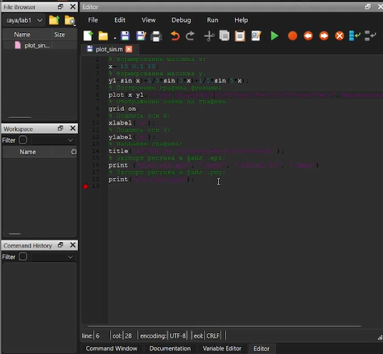{width=70%}

## Разложение меандра: Код meandr.m

Фрагмент кода, реализующий разложение меандра в ряд Фурье через косинусы. Задаются параметры гармоник N, время t, амплитуда A и период T.

{width=70%}

## Разложение меандра: Код meandr_sin.m

Альтернативный вариант реализации меандра через синусы. Показывает понимание двух форм ряда Фурье для одной и той же функции.

{width=70%}

# Часть 2: Спектральный анализ (БПФ)

## Подготовка к анализу: Код spectre.m

Создание двух синусоидальных сигналов разной частоты. Код задаёт параметры (fd, f1, f2, a1, a2) и формирует массивы.

{width=70%}

## Исходные сигналы во временной области

Визуализация двух сигналов: $\sin(2\pi \cdot 10 \cdot t)$ и $0.7 \cdot \sin(2\pi \cdot 40 \cdot t)$.

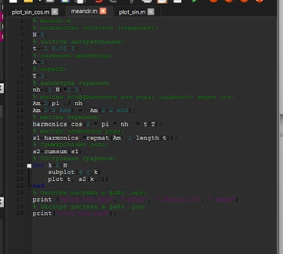{width=70%}

## Необработанный спектр сигналов

График амплитудного спектра без коррекции. Демонстрирует исходный результат применения БПФ с дублирующимися частотами.

{width=70%}

## Исправленный спектр сигналов

Нормированный спектр с отброшенными отрицательными частотами. Четко видны пики на частотах 10 Гц и 40 Гц.

{width=70%}

## Код расчёта суммы: spectre_sum.m

Код для проверки свойства аддитивности: спектр суммы сигналов должен быть равен сумме спектров.

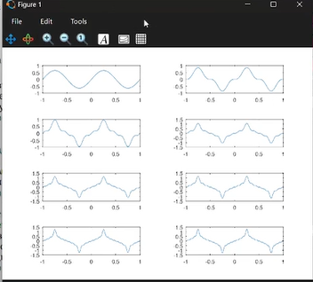{width=70%}

## Спектр суммарного сигнала

Подтверждение линейности преобразования Фурье. Спектр содержит те же частотные компоненты (10 и 40 Гц).

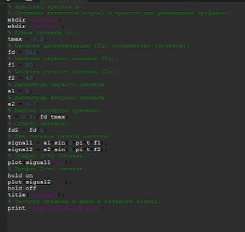{width=70%}

## График суммарного сигнала

Визуализация суммы сигналов во временной области перед проведением спектрального анализа.

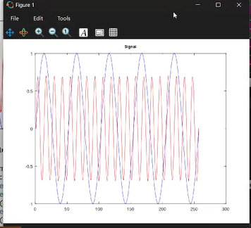{width=70%}

# Часть 3: Амплитудная модуляция (АМ)

## Моделирование АМ: Код am.m

Демонстрация принципов АМ. Код показывает перемножение низкочастотного сигнала (5 Гц) и несущей (50 Гц).

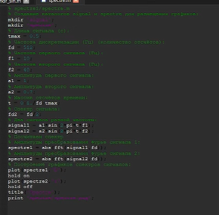{width=70%}

## Спектр АМ-сигнала

Иллюстрация свойства модуляции: спектр содержит несущую (50 Гц) и боковые полосы (45 Гц и 55 Гц).

{width=70%}

## АМ-сигнал и его огибающая

Наглядно показано, как изменяется амплитуда несущей в соответствии с модулирующим сигналом.

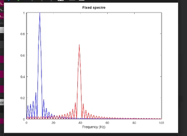{width=70%}

# Часть 4: Методы цифрового кодирования

## Установленные пакеты Octave

Проверка наличия пакета `signal`, необходимого для корректной работы функций кодирования.

{width=70%}

## Главный скрипт: main.m

Инициализация данных, создание каталогов и вызов функций кодирования. Основа для построения графиков.

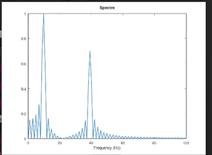{width=70%}

## Функция maptowave.m

Вспомогательная функция для преобразования битовой последовательности в волновой сигнал для визуализации.

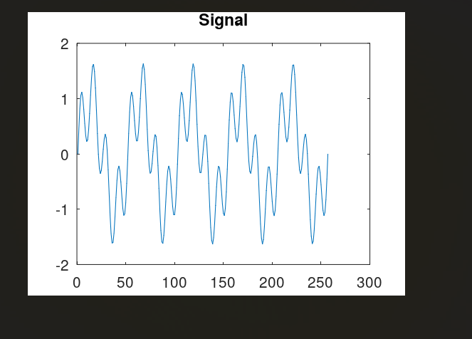{width=70%}

## Функция кодирования AMI

Реализация метода Alternate Mark Inversion. Показывает чередование полярности для логических единиц.

{width=70%}

## Функция кодирования RZ

Реализация метода Return to Zero (возврат к нулю). Обеспечивает переход в середине каждого бита.

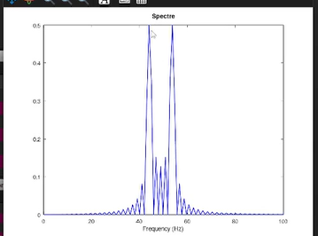{width=70%}

## Функция Manchester

Реализация кода с обязательным переходом в центре каждого битового интервала для самосинхронизации.

{width=70%}

## Функция Diff. Manchester

Более сложный метод, где информация кодируется наличием или отсутствием перепадов уровня.

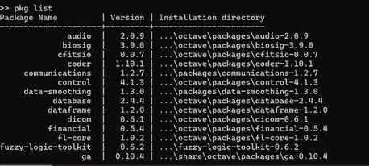{width=70%}

## График кодирования AMI

Пример кодирования последовательности. Демонстрация отсутствия постоянной составляющей за счет смены полярности.

{width=70%}

## График кодирования NRZ

Демонстрация простейшего двухуровневого кода без возврата к нулю (Non-Return to Zero).

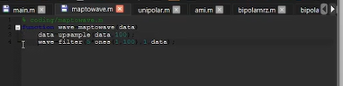{width=70%}

## Дифференциальный манчестерский код

Иллюстрация метода, где перепад в начале интервала означает «0», а его отсутствие — «1».

{width=70%}

## Манчестерское кодирование

Визуализация переходов: для «1» — переход вниз, для «0» — переход вверх в центре бита.

{width=70%}

## Детализация формы сигнала

Тот же сигнал дифференциального манчестерского кодирования в другом масштабе для детального анализа.

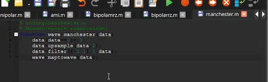{width=70%}

## График кодирования RZ

Показан трёхуровневый код с обязательным возвратом к нулю после каждого битового импульса.

{width=70%}

# Часть 5: Спектральные характеристики

## Спектр кодирования AMI

Анализ распределения энергии. Отсутствие пика на нулевой частоте (отсутствие постоянной составляющей).

{width=70%}

## Спектр кодирования NRZ

Сравнение с другими кодами: NRZ обладает наиболее узкой полосой пропускания, но имеет постоянную составляющую.

{width=70%}

## Спектр кодирования RZ

Анализ спектра RZ-кода. Из-за возврата к нулю полоса частот становится шире, чем у NRZ.

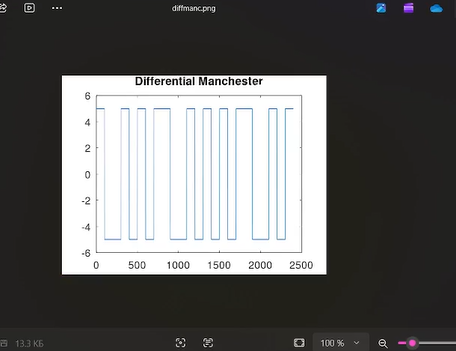{width=70%}

## Спектр Diff. Manchester

Изучение спектральных свойств метода, широко используемого в сетевых технологиях (например, Token Ring).

{width=70%}

## Спектр манчестерского кода

Показывает значительную энергию на высоких частотах, что важно учитывать при выборе физической среды.

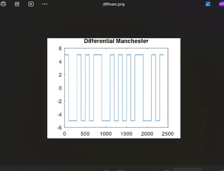{width=70%}

## Спектр униполярного кода

Базовый пример спектра простейшего кода для сравнения эффективности современных методов.

{width=70%}

# Часть 6: Свойства самосинхронизации

## Самосинхронизация AMI

Исследование: AMI сохраняет синхронизацию только при наличии единиц. При длинной серии нулей сигнал затухает.

{width=70%}

## Самосинхронизация NRZ

Демонстрация отсутствия самосинхронизации: при длинной серии одинаковых бит сигнал не меняется.

{width=70%}

## Самосинхронизация RZ

Благодаря возврату к нулю в каждом такте для единиц, код RZ обеспечивает лучшую синхронизацию.

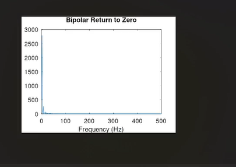{width=70%}

## Синхронизация Diff. Manchester

Подтверждение того, что метод обеспечивает самосинхронизацию независимо от передаваемых данных.

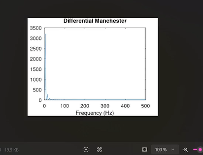{width=70%}

## Синхронизация Manchester

Обязательные переходы в центре каждого бита гарантируют надежное выделение тактовой частоты.

{width=70%}

## Синхронизация Unipolar

Иллюстрация полной непригодности униполярного кода для синхронизации при отсутствии переходов.

{width=70%}

# Часть 7: Дополнительные результаты

## Дополнительный спектр №1

Повторный анализ спектральных характеристик для верификации полученных данных.

{width=70%}

## Дополнительный спектр №2

Иллюстрация результатов под другим углом для уточнения формы боковых лепестков.

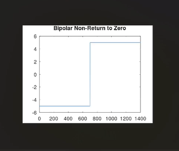{width=70%}

## Дополнительный спектр №3

Сравнение энергетических характеристик сигналов в различных форматах экспорта.

{width=70%}

## Уточнение временной диаграммы №1

Дополнительный график кодирования для анализа переходных процессов.

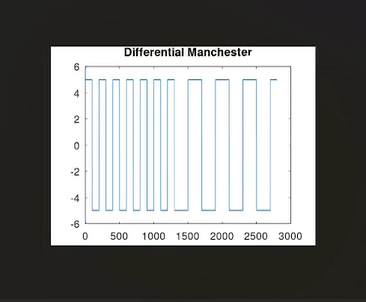{width=70%}

## Уточнение временной диаграммы №2

Временная развертка сигнала для подтверждения корректности работы m-файлов.

{width=70%}

## Уточнение временной диаграммы №3

Финальная проверка формирования кодированных последовательностей.

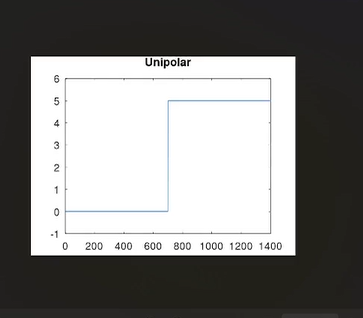{width=70%}

## Сводный график результатов

Итоговая визуализация всех проведенных экспериментов в рамках лабораторной работы.

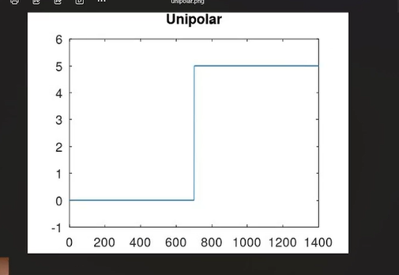{width=70%}

# Заключение

## Выводы по работе

* Изучены методы разложения сигналов в ряд Фурье и БПФ в среде Octave.
* Реализована модель амплитудной модуляции и проанализирован её спектр.
* На практике доказано, что манчестерские коды обеспечивают лучшую самосинхронизацию.
* Освоены навыки спектрального анализа цифровых и аналоговых сигналов.