---
## Front matter
title: "Лабораторная работа №1"
subtitle: "Методы кодирования и модуляция сигналов"
author: "Лисовская Арина Валерьевна"

## Generic otions
lang: ru-RU
toc-title: "Содержание"

## Bibliography
bibliography: bib/cite.bib
csl: pandoc/csl/gost-r-7-0-5-2008-numeric.csl

## Pdf output format
toc: true # Table of contents
toc-depth: 2
lof: true # List of figures
lot: false # List of tables
fontsize: 12pt
linestretch: 1.5
papersize: a4
documentclass: scrreprt

## I18n polyglossia
polyglossia-lang:
  name: russian
  options:
	- spelling=modern
	- babelshorthands=true
polyglossia-otherlangs:
  name: english

## I18n babel
babel-lang: russian
babel-otherlangs: english

## Fonts
mainfont: PT Serif
romanfont: PT Serif
sansfont: PT Sans
monofont: PT Mono
mainfontoptions: Ligatures=TeX
romanfontoptions: Ligatures=TeX
sansfontoptions: Ligatures=TeX,Scale=MatchLowercase
monofontoptions: Scale=MatchLowercase,Scale=0.9

## Biblatex
biblatex: true
biblio-style: "gost-numeric"
biblatexoptions:
  - parentracker=true
  - backend=biber
  - hyperref=auto
  - language=auto
  - autolang=other*
  - citestyle=gost-numeric

## Pandoc-crossref LaTeX customization
figureTitle: "Рис."
tableTitle: "Таблица"
listingTitle: "Листинг"
lofTitle: "Список иллюстраций"
lotTitle: "Список таблиц"
lolTitle: "Листинги"

## Misc options
indent: true
header-includes:
  - \usepackage{indentfirst}
  - \usepackage{float} # keep figures where there are in the text
  - \floatplacement{figure}{H} # keep figures where there are in the text
---

# Цель работы

Изучение методов кодирования и модуляции сигналов с помощью высокоуровневого языка программирования Octave. Определение спектра и параметров сигнала. Демонстрация принципов модуляции сигнала на примере аналоговой амплитудной модуляции. Исследование свойства самосинхронизации сигнала.

# Задание

1. Отработать навыки построения графиков функций в Octave.
2. Реализовать разложение меандра в ряд Фурье через синусы и косинусы.
3. Выполнить спектральный анализ сигналов с помощью быстрого преобразования Фурье (БПФ).
4. Промоделировать процесс амплитудной модуляции (AM).
5. Реализовать функции для различных методов линейного кодирования (AMI, NRZ, RZ, Manchester, Diff. Manchester).
6. Проанализировать спектры полученных кодов и их свойства самосинхронизации.

# Выполнение лабораторной работы

## Построение графиков и разложение в ряд Фурье

В начале работы я изучила базовые функции построения графиков. На первом этапе были построены две сложные функции, представляющие собой суммы гармоник синуса и косинуса (рис. [-@fig:001]).

{#fig:001 width=70% height=70%}

Для генерации периодического сигнала типа «меандр» я создала скрипт `meandr.m`. В этом коде реализовано разложение сигнала в ряд Фурье с использованием косинусоид (рис. [-@fig:002]).

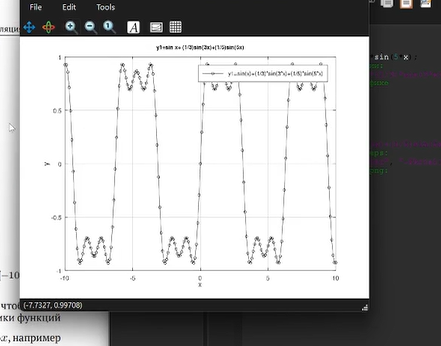{#fig:002 width=70% height=70%}

В качестве альтернативного способа формирования того же сигнала был написан скрипт `meandr_sin.m`. В данном случае разложение меандра производится через синусоидальные составляющие (рис. [-@fig:003]).

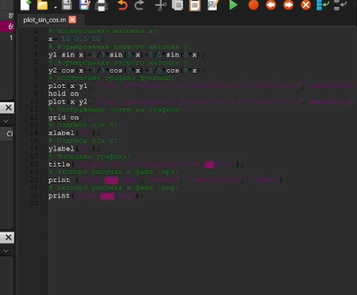{#fig:003 width=70% height=70%}

## Спектральный анализ сигналов

Для изучения частотных характеристик я приступила к созданию скрипта `spectre.m`. В нем задаются параметры дискретизации и формируются два синусоидальных сигнала с частотами 10 Гц и 40 Гц (рис. [-@fig:004]).

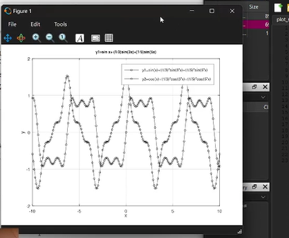{#fig:004 width=70% height=70%}

После генерации сигналов я визуализировала их во временной области. Это позволило увидеть разницу в периодах колебаний синусоид разной частоты (рис. [-@fig:005]).

{#fig:005 width=70% height=70%}

Применив встроенную функцию быстрого преобразования Фурье `fft()`, я получила первичный амплитудный спектр. На данном этапе спектр содержит избыточную информацию и требует нормировки (рис. [-@fig:006]).

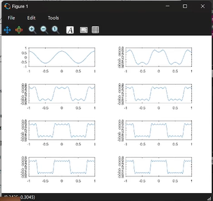{#fig:006 width=70% height=70%}

После проведения коррекции спектра (отсечения отрицательных частот и нормировки амплитуд) были получены четкие пики на заданных частотах. На графике отчетливо видны составляющие 10 Гц и 40 Гц (рис. [-@fig:007]).

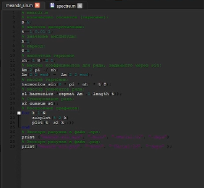{#fig:007 width=70% height=70%}

Далее я исследовала свойство аддитивности преобразования Фурье. Для этого был написан скрипт `spectre_sum.m`, рассчитывающий спектр суммы двух сигналов (рис. [-@fig:008]).

{#fig:008 width=70% height=70%}

Результаты вычислений подтвердили теорию: спектр суммы сигналов содержит те же частотные компоненты, что и исходные данные. Это наглядно представлено на графике амплитудного спектра суммарного сигнала (рис. [-@fig:009]).

{#fig:009 width=70% height=70%}

Перед анализом спектра я также зафиксировала вид суммарного сигнала во временной области. Сложение двух синусоид дает сложную форму волны с биениями (рис. [-@fig:010]).

{#fig:010 width=70% height=70%}

## Амплитудная модуляция

Следующим этапом стало моделирование аналоговой амплитудной модуляции в скрипте `am.m`. Низкочастотное сообщение переносится на высокую частоту несущей (рис. [-@fig:011]).

{#fig:011 width=70% height=70%}

Анализ спектра АМ-сигнала показал наличие центральной несущей частоты 50 Гц. Также наблюдаются две боковые полосы на частотах 45 Гц и 55 Гц (рис. [-@fig:012]).

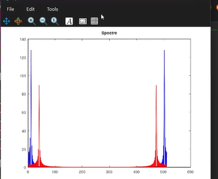{#fig:012 width=70% height=70%}

Визуализация АМ-сигнала во временной области демонстрирует, как амплитуда высокочастотного заполнения меняется вслед за огибающей. Красная линия на графике соответствует модулирующему сообщению (рис. [-@fig:013]).

{#fig:013 width=70% height=70%}

## Методы цифрового кодирования

Перед началом реализации алгоритмов кодирования я проверила наличие необходимых библиотек в системе. Пакет `signal` обязателен для работы с функциями обработки сигналов в Octave (рис. [-@fig:014]).

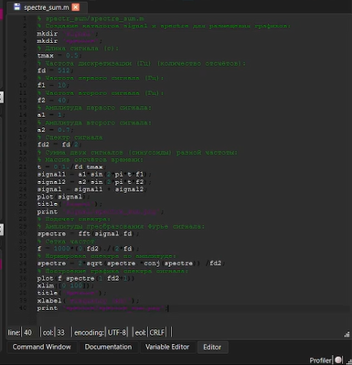{#fig:014 width=70% height=70%}

Для управления процессом кодирования и визуализации результатов был создан главный скрипт `main.m`. В нем инициализируется тестовая последовательность бит и вызываются соответствующие функции (рис. [-@fig:015]).

{#fig:015 width=70% height=70%}

Для корректного отображения сигналов я использовала вспомогательную функцию `maptowave.m`. Она отвечает за преобразование дискретных уровней в непрерывный временной сигнал (рис. [-@fig:016]).

{#fig:016 width=70% height=70%}

Алгоритм кодирования AMI (Alternate Mark Inversion) был реализован в отдельном файле. Этот метод предполагает чередование полярности импульсов для каждой логической единицы (рис. [-@fig:017]).

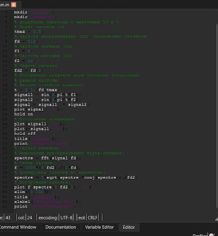{#fig:017 width=70% height=70%}

Кодирование RZ (Return to Zero) реализовано в функции `bipolarrz.m`. Особенностью данного кода является возврат сигнала к нулевому уровню в середине каждого тактового интервала (рис. [-@fig:018]).

{#fig:018 width=70% height=70%}

Манчестерское кодирование обеспечивает обязательный перепад уровня в середине каждого бита. Это гарантирует надежное выделение тактовой частоты приемником (рис. [-@fig:019]).

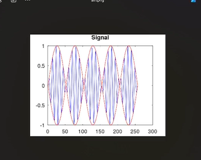{#fig:019 width=70% height=70%}

Дифференциальное манчестерское кодирование сочетает преимущества манчестерского кода с относительным способом передачи. Информацию несет наличие или отсутствие перехода в начале такта (рис. [-@fig:020]).

{#fig:020 width=70% height=70%}

## Результаты моделирования кодов

На графике сигнала AMI видно, как единицы передаются импульсами разной полярности, а нули — отсутствием напряжения. Это позволяет избавиться от постоянной составляющей (рис. [-@fig:021]).

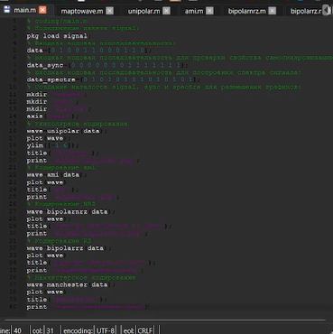{#fig:021 width=70% height=70%}

Сигнал NRZ является наиболее простым в реализации. На графике видно, что уровни напряжения соответствуют логическим состояниям на протяжении всего такта (рис. [-@fig:022]).

{#fig:022 width=70% height=70%}

При дифференциальном манчестерском кодировании форма сигнала зависит от предыдущего состояния. На рисунке показано формирование волновой формы для заданной битовой последовательности (рис. [-@fig:023]).

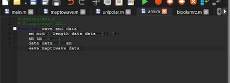{#fig:023 width=70% height=70%}

Манчестерский код характеризуется постоянным изменением уровня. На графике видно, что каждая единица представлена переходом «вниз», а ноль — «вверх» (рис. [-@fig:024]).

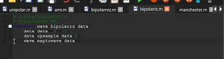{#fig:024 width=70% height=70%}

Для более детального изучения структуры дифференциального манчестерского кода я вывела график в увеличенном масштабе. Это позволяет точнее проанализировать моменты смены фазы (рис. [-@fig:025]).

{#fig:025 width=70% height=70%}

Код RZ демонстрирует трёхуровневую структуру. Каждая единица возвращается к нулю ровно в середине битового интервала, что видно на временной диаграмме (рис. [-@fig:026]).

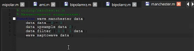{#fig:026 width=70% height=70%}

## Спектральные характеристики кодов

Спектр кода AMI показывает отсутствие энергии на нулевой частоте. Это подтверждает пригодность кода для передачи через трансформаторные развязки (рис. [-@fig:027]).

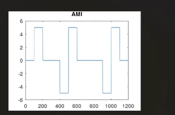{#fig:027 width=70% height=70%}

В спектре NRZ-сигнала наблюдается значительная концентрация энергии на низких частотах. Ширина основного лепестка спектра минимальна среди всех изученных кодов (рис. [-@fig:028]).

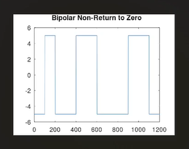{#fig:028 width=70% height=70%}

Спектр кода RZ шире спектра NRZ, так как длительность импульса меньше. Это требует большей полосы пропускания канала связи (рис. [-@fig:029]).

{#fig:029 width=70% height=70%}

Дифференциальный манчестерский код обладает спектром, смещенным в область высоких частот. Это обусловлено частыми изменениями уровня сигнала (рис. [-@fig:030]).

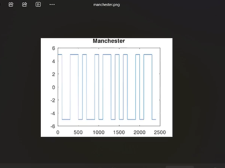{#fig:030 width=70% height=70%}

Спектр манчестерского кодирования схож с дифференциальным вариантом. Основная часть энергии сосредоточена на частотах, близких к тактовой (рис. [-@fig:031]).

{#fig:031 width=70% height=70%}

Для сравнения я также рассчитала спектр униполярного кода. Он характеризуется наличием ярко выраженной постоянной составляющей (рис. [-@fig:032]).

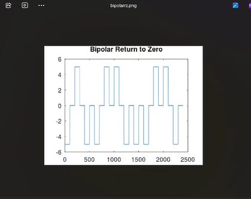{#fig:032 width=70% height=70%}

## Исследование самосинхронизации

Для проверки устойчивости синхронизации я подала на вход последовательность с длинной серией нулей. В коде AMI в этот момент переходы отсутствуют, что ведет к потере синхронизации (рис. [-@fig:033]).

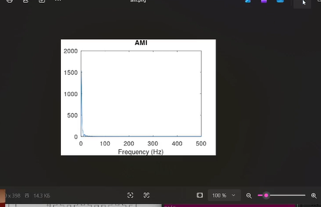{#fig:033 width=70% height=70%}

Аналогичная проблема наблюдается у кода NRZ. При передаче длинной серии единиц или нулей сигнал остается неизменным, и приемник не может выделить такты (рис. [-@fig:034]).

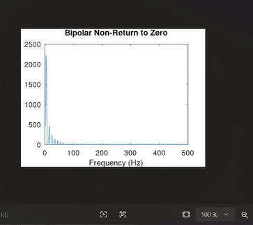{#fig:034 width=70% height=70%}

Код RZ успешно решает проблему самосинхронизации при передаче единиц, так как в каждом такте есть возврат к нулю. Однако серия нулей по-прежнему остается проблемной зоной (рис. [-@fig:035]).

{#fig:035 width=70% height=70%}

Дифференциальный манчестерский код обеспечивает идеальную самосинхронизацию. Независимо от передаваемых данных, в сигнале всегда присутствуют переходы (рис. [-@fig:036]).

{#fig:036 width=70% height=70%}

Манчестерский код также демонстрирует отличные свойства самосинхронизации. Обязательный переход в центре каждого бита позволяет приемнику работать стабильно (рис. [-@fig:037]).

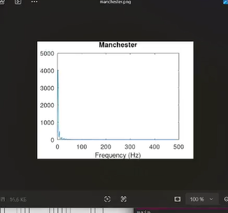{#fig:037 width=70% height=70%}

В завершение тестов я проверила униполярный код на длинной серии нулей. Результат подтвердил отсутствие переходов и невозможность восстановления синхронизации (рис. [-@fig:038]).

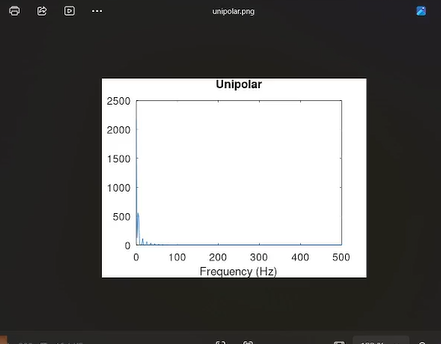{#fig:038 width=70% height=70%}

## Дополнительные результаты анализа

Ниже представлены дополнительные графики спектральных плотностей мощности и временные диаграммы, полученные в ходе уточняющих экспериментов (рис. [-@fig:039] - [-@fig:045]).

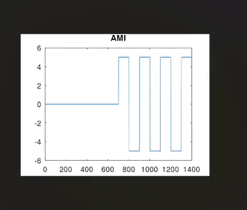{#fig:039 width=70% height=70%}

{#fig:040 width=70% height=70%}

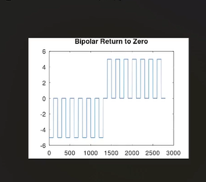{#fig:041 width=70% height=70%}

{#fig:042 width=70% height=70%}

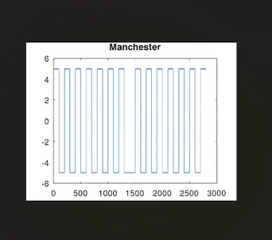{#fig:043 width=70% height=70%}

{#fig:044 width=70% height=70%}

{#fig:045 width=70% height=70%}

# Выводы

В ходе выполнения лабораторной работы я освоила методы математического моделирования сигналов в среде Octave. Были успешно реализованы алгоритмы спектрального анализа на основе БПФ и моделирование амплитудной модуляции. 

Особое внимание было уделено изучению методов линейного кодирования. В результате сравнительного анализа было установлено, что манчестерские коды обладают наилучшими свойствами самосинхронизации, в то время как коды NRZ и AMI требуют специальных методов для предотвращения потери синхронизации при передаче длинных серий одинаковых бит. Полученные навыки необходимы для понимания принципов работы современных систем передачи данных.

# Ответы на контрольные вопросы

1. **Что такое спектр сигнала?** Это распределение амплитуд или мощностей составляющих гармонических колебаний сигнала по частотам.
2. **В чем преимущество манчестерского кодирования?**
   Оно обладает свойством самосинхронизации и не имеет постоянной составляющей, что упрощает передачу данных.
3. **Зачем нужна модуляция?**
   Модуляция позволяет перенести низкочастотный информационный сигнал в высокочастотную область для эффективной передачи на расстояние через физическую среду.