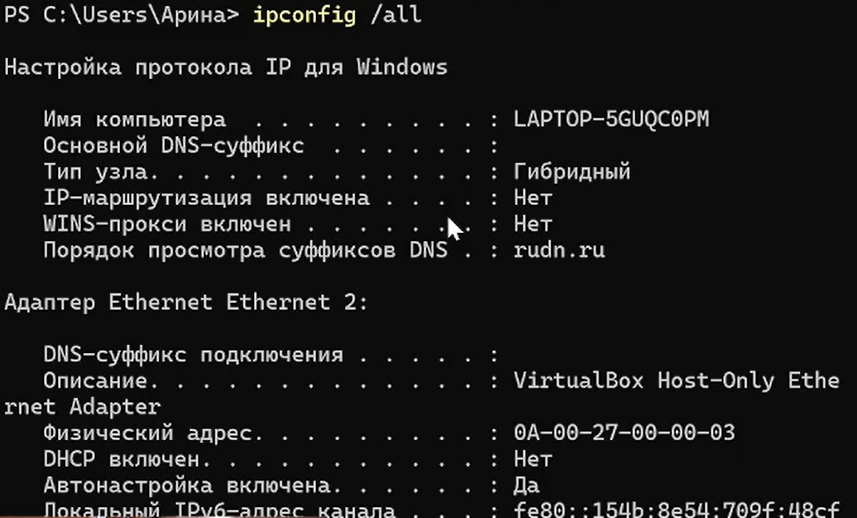
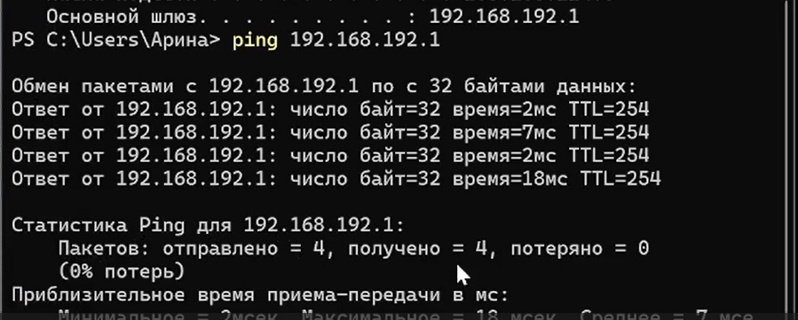
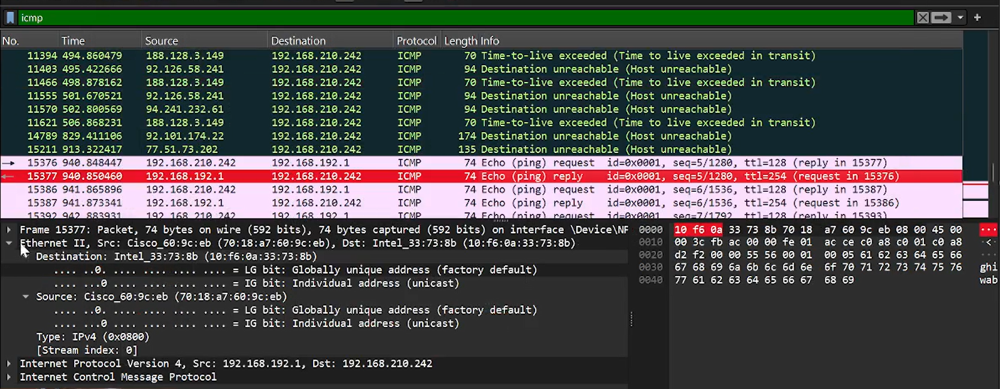
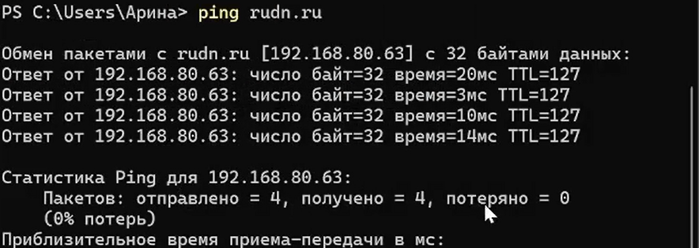
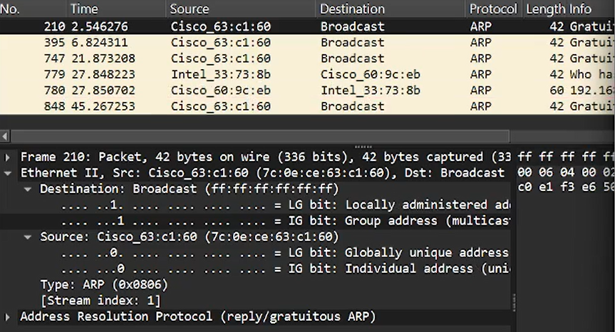
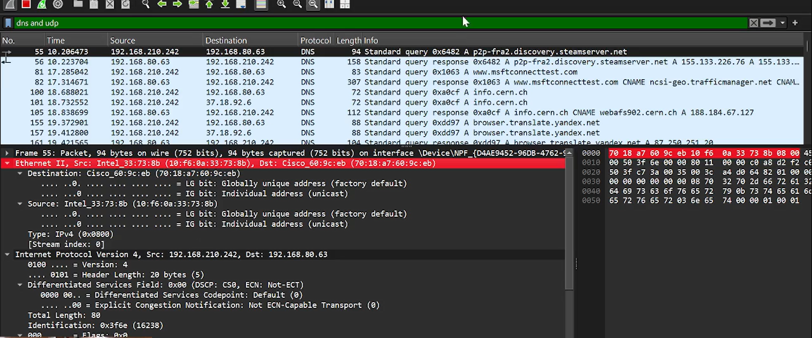

---
## Front matter
lang: ru-RU
title: Лабораторная работа №3
subtitle: "Анализ трафика в Wireshark"
author:
  - Лисовская А. В.
institute:
  - Российский университет дружбы народов, Москва, Россия
date: 18 декабря 2025

## i18n babel
babel-lang: russian
babel-otherlangs: english

## Formatting pdf
toc: false
toc-title: Содержание
slide_level: 2
aspectratio: 169
section-titles: true
theme: metropolis
header-includes:
 - \metroset{progressbar=frametitle,sectionpage=progressbar,numbering=fraction}
 - \makeatletter
 - \beamer@ignorenonframefalse
 - \makeatother

## Fonts
mainfont: PT Serif
romanfont: PT Serif
sansfont: PT Sans
monofont: PT Mono
mainfontoptions: Ligatures=TeX
romanfontoptions: Ligatures=TeX
sansfontoptions: Ligatures=TeX,Scale=MatchLowercase
monofontoptions: Scale=MatchLowercase,Scale=0.9
---

## Докладчик

:::::::::::::: {.columns align=center}
::: {.column width="70%"}

  * Лисовская Арина Валерьевна
  * Студент учебной группы
  * Российский университет дружбы народов

:::
::: {.column width="30%"}

## Цель работы

Изучение посредством Wireshark кадров Ethernet, анализ PDU протоколов транспортного и прикладного уровней стека TCP/IP.

## Задачи

1. Изучить сетевые настройки ОС (`ipconfig`, `getmac`).
2. Проанализировать работу протоколов ICMP и ARP.
3. Исследовать структуру HTTP-трафика.
4. Провести анализ процесса установления соединения (handshake) TCP.

# Выполнение работы: Сетевые настройки

## Изучение конфигурации IP

Команда `ipconfig /all` выводит детальную информацию о сетевых интерфейсах: имя компьютера, настройки DHCP и IPv6-адрес канала.

{width=70%}

## Определение MAC-адресов

С помощью утилиты `GETMAC` были определены физические адреса сетевых адаптеров и их текущее состояние (подключен/отключен).

{width=70%}

## Сведения о подключении (GUI)

Параметры сетевого адаптера Intel Wi-Fi и адрес шлюза (192.168.192.1) подтверждены через графический интерфейс ОС Windows.

{width=70%}

# Выполнение работы: Анализ трафика

## Захват ICMP-пакетов

В Wireshark проанализирована структура кадра Ethernet II. На скриншоте виден эхо-запрос от клиента к шлюзу и ответный пакет.

{width=70%}

## Пинг внешнего ресурса

Выполнен запрос к домену `rudn.ru`. IP-адрес узла — 192.168.80.63. Это действие позволило зафиксировать процесс разрешения имен.

{width=70%}

## Анализ ARP-пакетов

Пример широковещательного ARP-пакета (Gratuitous ARP). Использовался для обновления информации о физическом адресе в локальной сети.

{width=70%}

# Выполнение работы: TCP и HTTP

## Работа с протоколом HTTP

Для генерации трафика прикладного уровня осуществлен переход на сайт `info.cern.ch`. Зафиксированы GET-запросы и ответы сервера.

{width=70%}

## Анализ TCP Handshake

Наглядная иллюстрация установления соединения. Видны флаги SYN от клиента, SYN-ACK от сервера и завершающий ACK от клиента.

{width=70%}

## Выводы

* Освоены практические навыки работы в Wireshark.
* Изучена структура кадров канального и пакетов сетевого уровней.
* Проанализирован процесс «трехступенчатого рукопожатия» TCP.
* Научился определять OUI производителя по MAC-адресу.