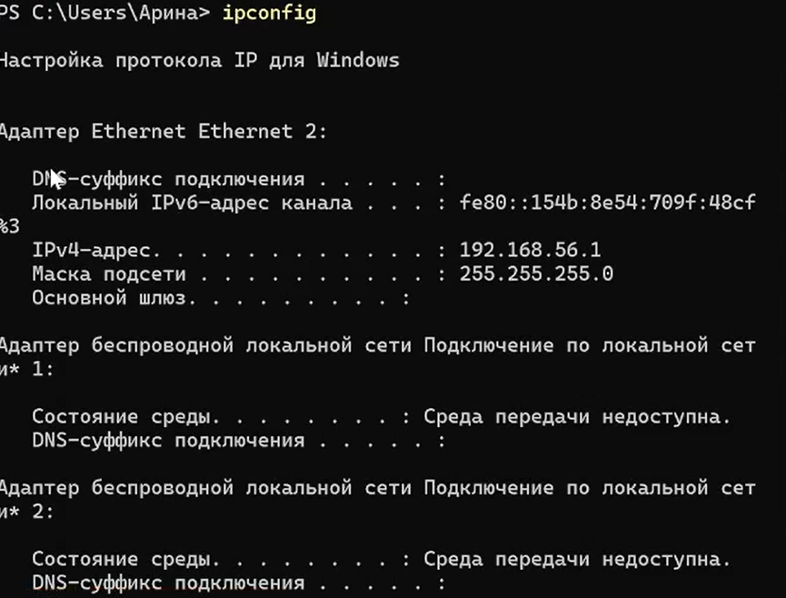
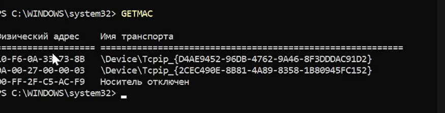
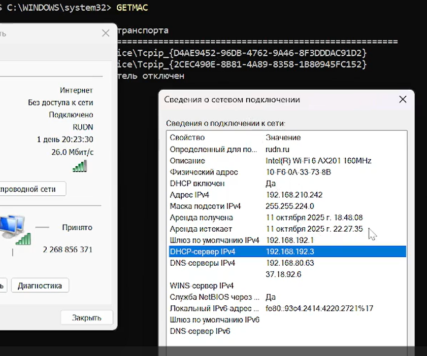
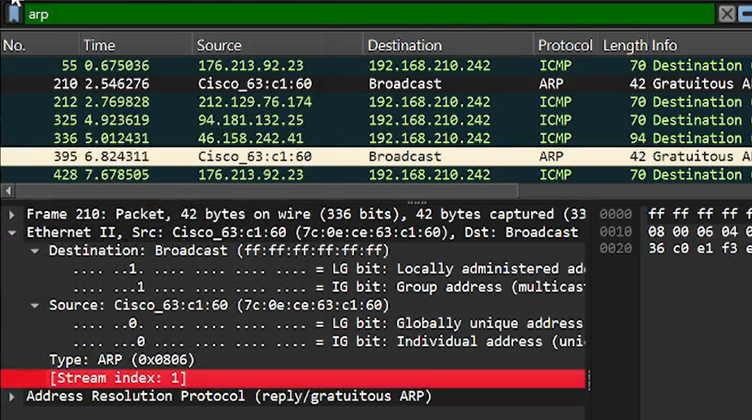
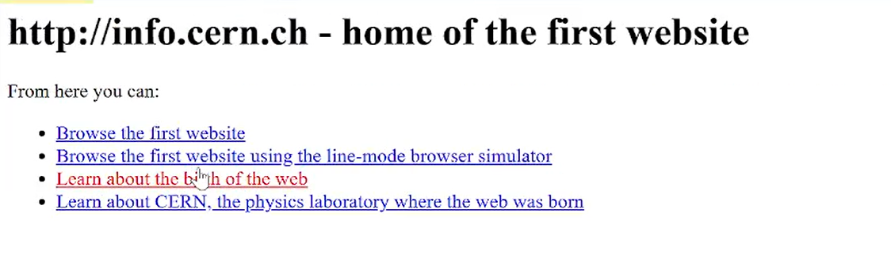
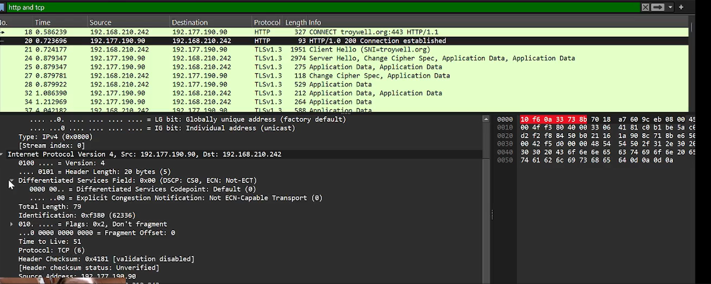
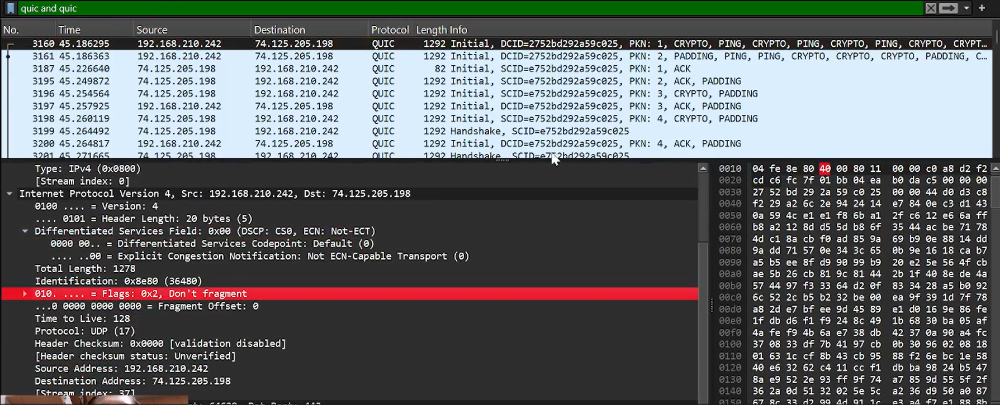

---
## Front matter
title: "Лабораторная работа №3"
subtitle: "Отчет: Анализ трафика в Wireshark"
author: "Лисовская Арина Валерьевна"

## Generic options
lang: ru-RU
toc-title: "Содержание"

## Bibliography
bibliography: bib/cite.bib
csl: pandoc/csl/gost-r-7-0-5-2008-numeric.csl

## Pdf output format
toc: true # Table of contents
toc-depth: 2
lof: true # List of figures
lot: false # List of tables
fontsize: 12pt
linestretch: 1.5
papersize: a4
documentclass: scrreprt

## I18n polyglossia
polyglossia-lang:
  name: russian
  options:
	- spelling=modern
	- babelshorthands=true
polyglossia-otherlangs:
  name: english

## I18n babel
babel-lang: russian
babel-otherlangs: english

## Fonts
mainfont: PT Serif
romanfont: PT Serif
sansfont: PT Sans
monofont: PT Mono
mainfontoptions: Ligatures=TeX
romanfontoptions: Ligatures=TeX
sansfontoptions: Ligatures=TeX,Scale=MatchLowercase
monofontoptions: Scale=MatchLowercase,Scale=0.9

## Biblatex
biblatex: true
biblio-style: "gost-numeric"
biblatexoptions:
  - parentracker=true
  - backend=biber
  - hyperref=auto
  - language=auto
  - autolang=other*
  - citestyle=gost-numeric

## Pandoc-crossref LaTeX customization
figureTitle: "Рис."
tableTitle: "Таблица"
listingTitle: "Листинг"
lofTitle: "Список иллюстраций"
lotTitle: "Список таблиц"
lolTitle: "Листинги"

## Misc options
indent: true
header-includes:
  - \usepackage{indentfirst}
  - \usepackage{float} # keep figures where there are in the text
  - \floatplacement{figure}{H} # keep figures where there are in the text
---

# Цель работы

Изучение посредством Wireshark кадров Ethernet, анализ PDU протоколов транспортного и прикладного уровней стека TCP/IP.

# Задание

1. Изучить сетевые настройки ОС с помощью консольных утилит `ipconfig` и `getmac`.
2. Проанализировать работу протоколов ICMP и ARP при помощи захвата трафика в Wireshark.
3. Исследовать структуру HTTP-трафика при обращении к веб-ресурсам.
4. Провести детальный анализ процесса установления соединения (handshake) протокола TCP.

# Выполнение лабораторной работы

## Анализ сетевых интерфейсов

Для начала работы необходимо определить текущие параметры сетевого подключения. Запускаю терминал и ввожу команду для вывода общей информации об интерфейсах (рис. [-@fig:001]):

{#fig:001 width=70% height=70%}

Более подробную информацию о конфигурации, включая адреса DNS-серверов и статус DHCP, получаю с помощью команды `ipconfig /all` (рис. [-@fig:002]):

{#fig:002 width=70% height=70%}

Далее перехожу к определению физических адресов сетевых адаптеров. Для этого использую специализированную команду `getmac` (рис. [-@fig:003]):

{#fig:003 width=70% height=70%}

Для верификации данных открываю графический интерфейс настроек Windows, где сопоставляю полученные ранее MAC-адреса и параметры IPv4 (рис. [-@fig:004]):

{#fig:004 width=70% height=70%}

## Работа с протоколами ICMP и ARP

Приступаю к генерации сетевого трафика для последующего анализа. Проверяю доступность шлюза по умолчанию с помощью утилиты `ping` (рис. [-@fig:005]):

{#fig:005 width=70% height=70%}

Запускаю процесс захвата в Wireshark и анализирую структуру сформированных ICMP-пакетов (рис. [-@fig:006]):

{#fig:006 width=70% height=70%}

В окне Wireshark детально рассматриваю кадр Ethernet II и вложенный в него ICMP эхо-запрос (рис. [-@fig:007]):

{#fig:007 width=70% height=70%}

Для удобства анализа применяю фильтрацию, оставляя только интересующие нас протоколы сетевого уровня (рис. [-@fig:008]):

{#fig:008 width=70% height=70%}

Выполняю проверку связи с внешним доменом `rudn.ru` для отслеживания процесса разрешения имен и передачи пакетов через внешние шлюзы (рис. [-@fig:009]):

{#fig:009 width=70% height=70%}

После завершения обмена пакетами изучаю итоговую статистику по потерям и времени задержки в консоли (рис. [-@fig:010]):

{#fig:010 width=70% height=70%}

Анализирую захваченные ARP-сообщения, в частности Gratuitous ARP, которые используются для оповещения сети о MAC-адресе устройства (рис. [-@fig:011]):

{#fig:011 width=70% height=70%}

## Исследование протоколов TCP и HTTP

Перехожу к анализу трафика прикладного уровня. Для этого открываю в браузере демонстрационный сайт, работающий по протоколу HTTP (рис. [-@fig:012]):

{#fig:012 width=70% height=70%}

В Wireshark нахожу соответствующий HTTP GET запрос, инициированный браузером (рис. [-@fig:013]):

{#fig:013 width=70% height=70%}

Изучаю структуру HTTP-ответа от сервера, обращая внимание на коды состояния и заголовки (рис. [-@fig:014]):

{#fig:014 width=70% height=70%}

Для понимания того, как данные передаются на транспортном уровне, анализирую содержимое TCP-сегмента (рис. [-@fig:015]):

{#fig:015 width=70% height=70%}

Особое внимание уделяю процессу «трехэтапного рукопожатия» (SYN, SYN-ACK, ACK) перед началом передачи данных (рис. [-@fig:016]):

{#fig:016 width=70% height=70%}

Использую встроенный инструмент «График потока» (Flow Graph) для визуализации обмена сообщениями между клиентом и сервером (рис. [-@fig:017]):

{#fig:017 width=70% height=70%}

Завершаю захват трафика и подвожу итоги по собранным данным в статистическом модуле (рис. [-@fig:018]):

{#fig:018 width=70% height=70%}

# Выводы

В ходе выполнения лабораторной работы я освоил практические навыки работы с анализатором сетевого трафика Wireshark. Мною были изучены структуры кадров Ethernet, пакетов ICMP и ARP, а также механизмы работы транспортного протокола TCP и прикладного протокола HTTP. Я научился идентифицировать MAC-адреса, анализировать процесс установления TCP-соединения и использовать фильтры Wireshark для эффективного поиска сетевых событий.

# Ответы на контрольные вопросы

1. **Как называются PDU для 2, 3 и 4 уровней модели OSI?**
   - 2 уровень (Канальный): Кадр (Frame).
   - 3 уровень (Сетевой): Пакет (Packet).
   - 4 уровень (Транспортный): Сегмент (Segment) для TCP или Датаграмма (Datagram) для UDP.

2. **Что такое OUI в MAC-адресе?**
   - OUI (Organizationally Unique Identifier) — это первые три байта (24 бита) MAC-адреса, которые однозначно идентифицируют производителя сетевого оборудования.

3. **Какие основные флаги используются в TCP-заголовке для управления соединением?**
   - SYN (Synchronize): запрос на установление соединения.
   - ACK (Acknowledgment): подтверждение получения.
   - FIN (Finish): запрос на завершение соединения.
   - RST (Reset): обрыв соединения при ошибке.
   - PSH (Push): немедленная передача данных приложению.

4. **В чем различие между утилитами Ping и Tracert?**
   - `ping` проверяет наличие связи с узлом и измеряет задержку.
   - `tracert` (traceroute) показывает весь маршрут следования пакета, перечисляя все промежуточные узлы (маршрутизаторы), через которые он проходит.