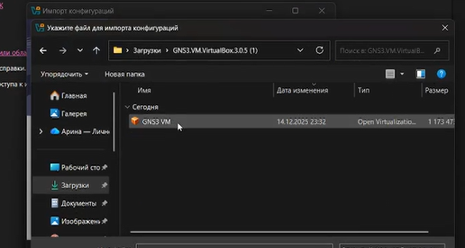
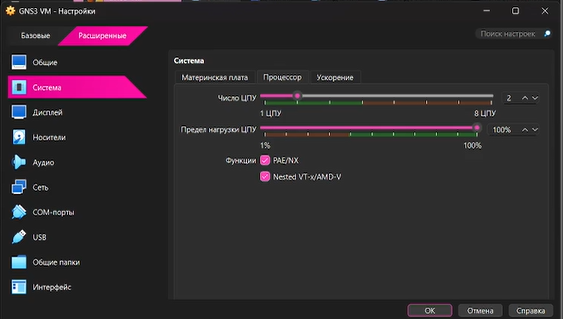
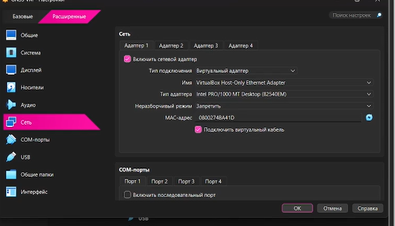
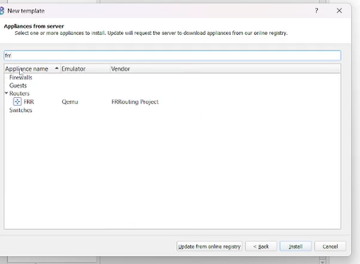
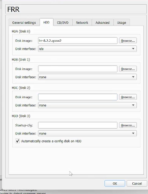
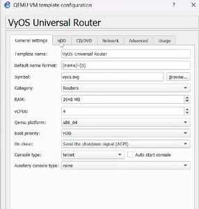

---
## Front matter
lang: ru-RU
title: Лабораторная работа №4
subtitle: "Подготовка экспериментального стенда GNS3"
author:
  - Лисовская А.В.
institute:
  - Российский университет дружбы народов, Москва, Россия
date: 14 декабря 2025

## i18n babel
babel-lang: russian
babel-otherlangs: english

## Formatting pdf
toc: false
toc-title: Содержание
slide_level: 2
aspectratio: 169
section-titles: true
theme: metropolis
header-includes:
 - \metroset{progressbar=frametitle,sectionpage=progressbar,numbering=fraction}
 - '\makeatletter'
 - '\beamer@ignorenonframefalse'
 - '\makeatother'

## Fonts
mainfont: PT Serif
romanfont: PT Serif
sansfont: PT Sans
monofont: PT Mono
mainfontoptions: Ligatures=TeX
romanfontoptions: Ligatures=TeX
sansfontoptions: Ligatures=TeX,Scale=MatchLowercase
monofontoptions: Scale=MatchLowercase,Scale=0.9
---

## Докладчик

:::::::::::::: {.columns align=center}
::: {.column width="70%"}

  * Лисовская Арина Валерьевна
  * Студент, НПИбд01-23
  * Российский университет дружбы народов
  * [1132231434@pfur.ru](mailto:1132231434@pfur.ru)

:::
::: {.column width="30%"}

:::
::::::::::::::

## Цель работы

Установка и настройка GNS3 и сопутствующего программного обеспечения для эмуляции компьютерных сетей. Изучение принципов работы виртуальной среды и импорт образов сетевых устройств.

## Задание

1. Установить пакет GNS3-all-in-one и виртуальную машину GNS3 VM.
2. Настроить параметры виртуализации и сетевого взаимодействия в VirtualBox.
3. Выполнить интеграцию клиента GNS3 с сервером.
4. Импортировать и настроить шаблоны маршрутизаторов FRR и VyOS.

## Установка GNS3 через Chocolatey

Выполняется установка пакета GNS3-all-in-one с помощью менеджера пакетов Chocolatey в PowerShell с правами администратора. Система сообщает, что версия 3.0.5 уже установлена.

{width=60%}

## Импорт образа GNS3 VM

Начальный этап установки виртуальной машины GNS3. Выполняется импорт скачанного OVA-файла образа в VirtualBox для подготовки виртуальной среды.

{width=60%}

## Настройка системных параметров VM

В настройках виртуальной машины выделяется 4096 МБ оперативной памяти и выбирается чипсет PIIX3 для обеспечения стабильной работы GNS3 VM.

{width=60%}

## Включение вложенной виртуализации

Активация опции Nested VT-x/AMD-V в настройках процессора. Это критически важный шаг для запуска других виртуальных машин и эмуляторов (например, QEMU) внутри GNS3 VM.

{width=60%}

## Сетевой адаптер Host-Only

Настройка сетевого адаптера №1 в режиме «Виртуальный адаптер хоста». Это создает приватную сеть между физическим ПК и виртуальной машиной для управления GNS3.

{width=60%}

## Параметры Host-Only сети

Проверка настроек виртуальной сети vboxnet0 в Менеджере сетей хоста. Установлен фиксированный IP-адрес 192.168.56.1 для взаимодействия хоста с VM.

{width=60%}

## Настройка DHCP-сервера

Включение DHCP-сервера для Host-Only сети с диапазоном адресов 192.168.56.100–254. Это упрощает автоматическое назначение IP-адресов компонентам стенда.

{width=60%}

## Запущенная консоль GNS3 VM

Подтверждение успешного старта виртуальной машины. В консоли отображается версия сервера (3.8.5), IP-адрес (192.168.56.188) и порт (80).

{width=60%}

## Вход в GNS3 VM по SSH

Демонстрация возможности прямого администрирования через терминал. Выполнен вход под пользователем gns3 в систему Ubuntu 24.04.

{width=60%}

## Настройка удаленного контроллера

Интеграция клиентского приложения GNS3 с сервером в VM. Настроен удаленный контроллер с использованием IP-адреса и порта виртуальной машины.

{width=60%}

## Консольное приложение по умолчанию

Выбор внешнего Telnet-клиента (puffy_standalone.exe) для работы с консолями эмулируемых сетевых устройств (маршрутизаторов и коммутаторов).

{width=60%}

## Выбор шаблона FRR

Начало процесса добавления образа маршрутизатора FRR (FRRouting Project). Пользователь инициирует создание нового шаблона через мастер GNS3.

{width=60%}

## Выбор версии образа FRR

Выбор конкретной версии программного обеспечения. Версия 8.2.2 помечена как готовая к установке, так как её файлы найдены на контроллере.

{width=60%}

## Параметры шаблона FRR

Настройка вычислительных ресурсов (256 МБ ОЗУ, 1 vCPU) и установка параметра корректного выключения через сигнал ACPI при закрытии проекта.

{width=60%}

## Настройка диска для FRR

Указание образа HDD и активация опции автоматического создания config-диска для сохранения конфигураций маршрутизатора между сессиями.

{width=60%}

## Подготовка образа VyOS

Выбор и проверка файлов для второго маршрутизатора — VyOS Universal Router версии 1.3.3. Файл образа qcow2 успешно найден в системе.

{width=60%}

## Импорт файлов VyOS

Промежуточный технический этап загрузки и импорта необходимых файлов (vyos-1.3.3-tvm-amd64.qcow2 и empty8G.qcow2) в библиотеку GNS3.

{width=60%}

## Параметры ресурсов VyOS

Выделение ресурсов для VyOS (1024 МБ ОЗУ, 1 vCPU). Установка режима выключения ACPI для предотвращения повреждения файловой системы.

{width=60%}

## Настройка диска для VyOS

Завершающий этап настройки хранилища. Включение автоматического создания config-диска для обеспечения постоянства настроек сетевой ОС.

{width=60%}

## Выводы

* Приобретены навыки установки и развертывания среды эмуляции GNS3.
* Изучены основы настройки вложенной виртуализации и сетевых адаптеров в VirtualBox.
* Освоены методы интеграции клиента с GNS3 VM и импорта образов сетевых ОС (FRR, VyOS).
* Создана база для дальнейшего проектирования и тестирования сложных сетевых топологий.