---
## Front matter
title: "Лабораторная работа №4"
subtitle: "Отчет"
author: "Лисовская Арина Валерьевна"

## Generic otions
lang: ru-RU
toc-title: "Содержание"

## Bibliography
bibliography: bib/cite.bib
csl: pandoc/csl/gost-r-7-0-5-2008-numeric.csl

## Pdf output format
toc: true # Table of contents
toc-depth: 2
lof: true # List of figures
lot: false # List of tables
fontsize: 12pt
linestretch: 1.5
papersize: a4
documentclass: scrreprt

## I18n polyglossia
polyglossia-lang:
  name: russian
  options:
	- spelling=modern
	- babelshorthands=true
polyglossia-otherlangs:
  name: english

## I18n babel
babel-lang: russian
babel-otherlangs: english

## Fonts
mainfont: PT Serif
romanfont: PT Serif
sansfont: PT Sans
monofont: PT Mono
mainfontoptions: Ligatures=TeX
romanfontoptions: Ligatures=TeX
sansfontoptions: Ligatures=TeX,Scale=MatchLowercase
monofontoptions: Scale=MatchLowercase,Scale=0.9

## Biblatex
biblatex: true
biblio-style: "gost-numeric"
biblatexoptions:
  - parentracker=true
  - backend=biber
  - hyperref=auto
  - language=auto
  - autolang=other*
  - citestyle=gost-numeric

## Pandoc-crossref LaTeX customization
figureTitle: "Рис."
tableTitle: "Таблица"
listingTitle: "Листинг"
lofTitle: "Список иллюстраций"
lot_title: "Список таблиц"
lolTitle: "Листинги"

## Misc options
indent: true
header-includes:
  - \usepackage{indentfirst}
  - \usepackage{float} # keep figures where there are in the text
  - \floatplacement{figure}{H} # keep figures where there are in the text
---

# Цель работы

Установка и настройка GNS3 и сопутствующего программного обеспечения для эмуляции компьютерных сетей. Изучение принципов работы виртуальной среды и импорт образов сетевых устройств.

# Задание

1. Установить пакет GNS3-all-in-one и виртуальную машину GNS3 VM.
2. Настроить параметры виртуализации и сетевого взаимодействия в VirtualBox.
3. Выполнить интеграцию клиента GNS3 с сервером.
4. Импортировать и настроить шаблоны маршрутизаторов FRR и VyOS.

# Выполнение лабораторной работы

Первым шагом я приступаю к установке клиентской части GNS3. Для автоматизации процесса в ОС Windows использую менеджер пакетов Chocolatey, запуская команду установки в терминале PowerShell с правами администратора, что позволяет избежать проблем с правами доступа (рис.[-@fig:001]).

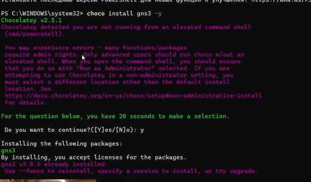{#fig:001 width=70% height=70%}

После подготовки клиентской части необходимо импортировать среду исполнения — GNS3 VM. Я открываю VirtualBox и использую мастер импорта конфигураций для добавления предварительно скачанного файла образа в формате OVA, который станет основным сервером для запуска сетевых устройств (рис.[-@fig:002]).

{#fig:002 width=70% height=70%}

Для стабильной работы виртуальной машины необходимо выделить достаточный объем ресурсов. В настройках системы я устанавливаю объем оперативной памяти 4096 МБ и выбираю подходящий чипсет, что соответствует рекомендациям для лабораторных работ (рис.[-@fig:003]).

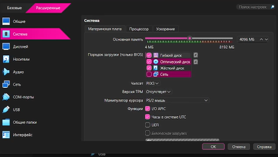{#fig:003 width=70% height=70%}

Критически важным этапом является настройка процессора виртуальной машины. Я активирую опцию Nested VT-x/AMD-V (вложенная виртуализация), которая позволяет GNS3 VM запускать внутри себя другие виртуальные сущности, такие как QEMU-узлы (рис.[-@fig:004]).

{#fig:004 width=70% height=70%}

Настройка сетевого взаимодействия осуществляется через создание приватной сети между хостом и виртуальной машиной. Я выбираю первый адаптер и перевожу его в режим «Виртуальный адаптер хоста», используя интерфейс VirtualBox Host-Only Ethernet Adapter (рис.[-@fig:005]).

{#fig:005 width=70% height=70%}

Далее я проверяю параметры самой виртуальной сети в менеджере сетей хоста. Убеждаюсь, что адаптер имеет статический IP-адрес 192.168.56.1, который будет служить шлюзом для управления виртуальной машиной (рис.[-@fig:006]).

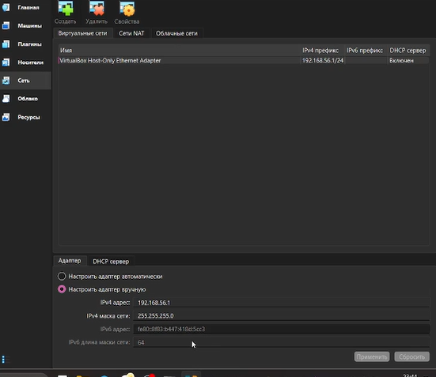{#fig:006 width=70% height=70%}

Для автоматизации выдачи IP-адресов внутри виртуальной среды я настраиваю DHCP-сервер. Задаю рабочий диапазон адресов от 192.168.56.100 до 192.168.56.254, что исключит конфликты с адресом управления (рис.[-@fig:007]).

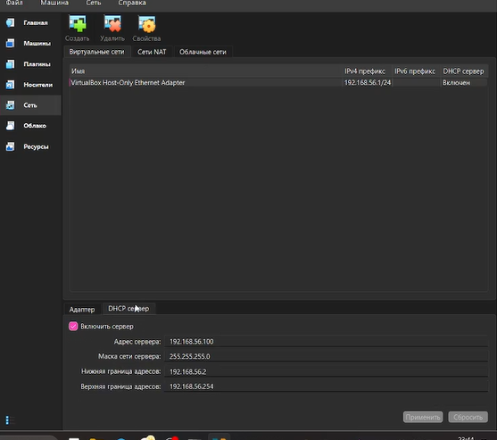{#fig:007 width=70% height=70%}

Запускаю GNS3 VM и контролирую процесс загрузки через консоль VirtualBox. После успешного старта на экране отображается служебная информация, включая IP-адрес 192.168.56.188, назначенный для работы API-сервера GNS3 (рис.[-@fig:008]).

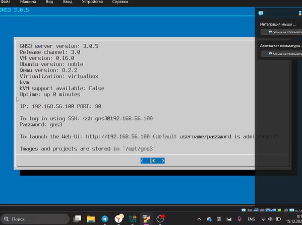{#fig:008 width=70% height=70%}

Для подтверждения доступности системы я выполняю вход в консоль виртуальной машины по протоколу SSH. Успешная авторизация пользователя gns3 подтверждает корректную работу операционной системы Ubuntu и готовность серверной части (рис.[-@fig:009]).

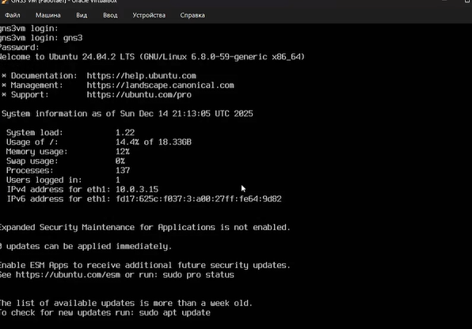{#fig:009 width=70% height=70%}

Теперь необходимо связать клиентское приложение с удаленным сервером. В настройках GNS3 в разделе «Controller» я прописываю IP-адрес виртуальной машины и порт, обеспечивая интеграцию локального интерфейса с мощностями VM (рис.[-@fig:010]).

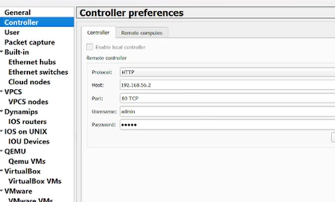{#fig:010 width=70% height=70%}

Для удобства взаимодействия с сетевыми устройствами я настраиваю внешнее консольное приложение. Выбираю PuTTY (puffy_standalone.exe) в качестве терминала по умолчанию для всех Telnet-сессий внутри проектов (рис.[-@fig:011]).

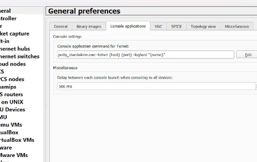{#fig:011 width=70% height=70%}

Перехожу к импорту образов сетевого оборудования, начиная с FRRouting. Используя мастер создания шаблонов, я нахожу образ «FRR» в категории маршрутизаторов, который будет использоваться в качестве базового узла (рис.[-@fig:012]).

{#fig:012 width=70% height=70%}

Система предлагает список доступных версий программного обеспечения. Я выбираю версию 8.2.2, которая помечена как готовая к установке («Ready to install»), что означает наличие всех необходимых бинарных файлов на сервере (рис.[-@fig:013]).

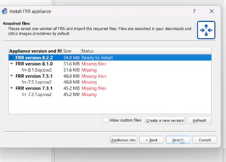{#fig:013 width=70% height=70%}

В общих настройках шаблона FRR я задаю параметры потребления ресурсов. Важным пунктом является выбор сигнала ACPI для корректного выключения устройства, что предотвратит потерю данных при закрытии проекта (рис.[-@fig:014]).

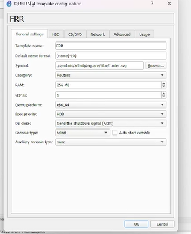{#fig:014 width=70% height=70%}

Завершаю настройку хранилища для FRR, указывая путь к виртуальному диску. Активирую опцию автоматического создания конфигурационного диска, чтобы все изменения в настройках маршрутизатора сохранялись между запусками (рис.[-@fig:015]).

{#fig:015 width=70% height=70%}

Следующим шагом я добавляю образ маршрутизатора VyOS. В мастере выбора файлов я указываю версию 1.3.3 и убеждаюсь, что файл образа .qcow2 успешно распознан контроллером GNS3 (рис.[-@fig:016]).

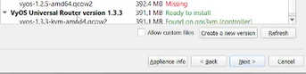{#fig:016 width=70% height=70%}

Запускается процесс импорта файлов VyOS в библиотеку шаблонов. На этом этапе происходит физическое копирование тяжелых образов дисков (таких как vyos-1.3.3-tvm-amd64.qcow2) в хранилище виртуальной машины (рис.[-@fig:017]).

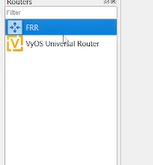{#fig:017 width=70% height=70%}

Для маршрутизатора VyOS я выделяю 1024 МБ оперативной памяти и 1 виртуальное ядро процессора. Как и для предыдущего устройства, настраиваю корректное завершение работы через ACPI-сигнал (рис.[-@fig:018]).

{#fig:018 width=70% height=70%}

В финальной вкладке настроек HDD для VyOS я подтверждаю использование основного образа и включаю функцию автоматического создания config-диска, завершая тем самым подготовку экспериментального стенда (рис.[-@fig:019]).

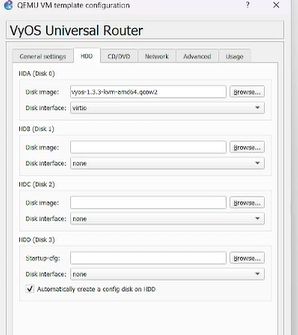{#fig:019 width=70% height=70%}

# Выводы

В ходе выполнения данной лабораторной работы я приобрел практические навыки установки и развертывания среды эмуляции сетевых устройств GNS3. Мною были изучены основы настройки вложенной виртуализации в VirtualBox, принципы работы клиент-серверной архитектуры GNS3 и методы импорта образов сетевых ОС (FRR, VyOS). Данная база необходима для дальнейшего проектирования и тестирования сложных сетевых топологий.

# Ответы на контрольные вопросы

1. **Что такое GNS3?**
   GNS3 (Graphical Network Simulator-3) — это программное обеспечение с открытым исходным кодом, предназначенное для графического моделирования и эмуляции компьютерных сетей любой сложности.

2. **Чем эмуляция отличается от имитации?**
   Эмуляция подразумевает запуск реального бинарного кода сетевой ОС на виртуальном оборудовании (например, через QEMU), в то время как имитация (моделирование) лишь воспроизводит логику работы протоколов без использования реальной системы.

3. **Перечислите основные компоненты GNS3.**
   GNS3 состоит из клиентского приложения (GUI), сервера управления (GNS3 Server/VM) и различных движков виртуализации (QEMU, Docker, Dynamips, VPCS).

4. **Зачем нужна вложенная виртуализация (Nested Virtualization)?**
   Она необходима для того, чтобы виртуальная машина GNS3 VM могла использовать аппаратное ускорение KVM для запуска других виртуальных машин (узлов сети) внутри себя, что значительно повышает производительность.

5. **Каким образом обеспечивается сохранение конфигурации устройств?**
   Сохранение обеспечивается использованием специальных конфигурационных дисков (Config Disk), которые GNS3 автоматически создает и подключает к виртуальным узлам.