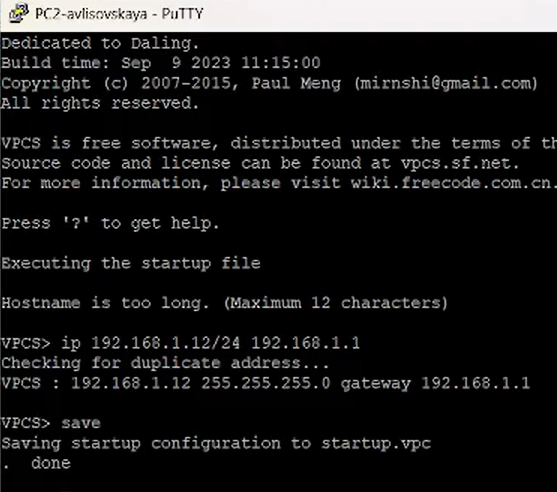
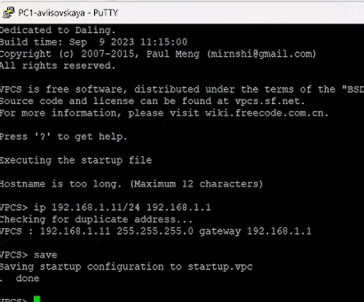
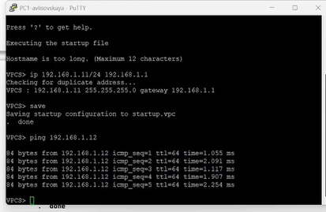
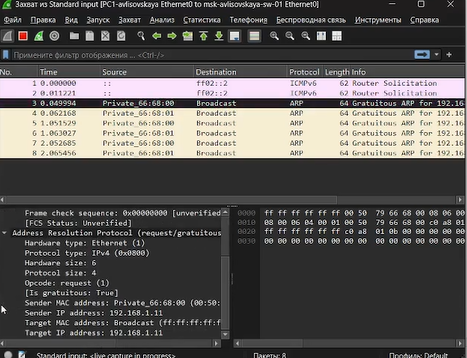
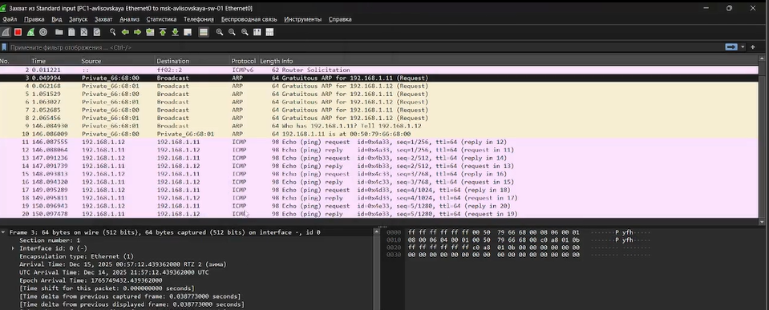
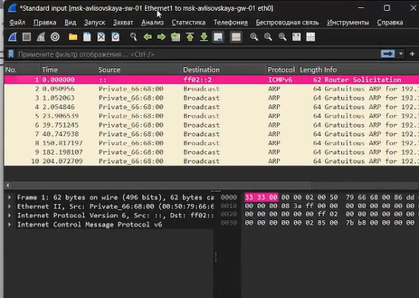
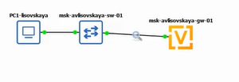
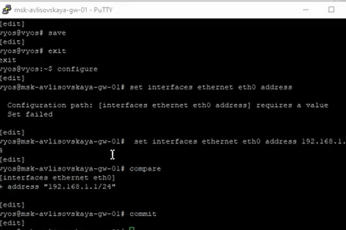
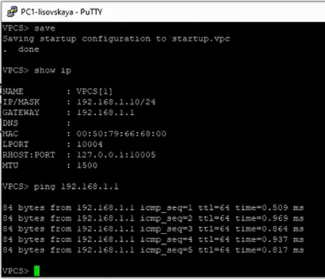
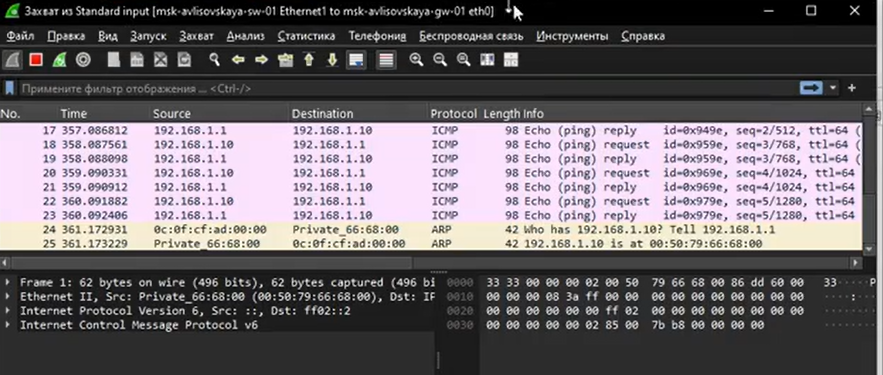

---
## Front matter
lang: ru-RU
title: Лабораторная работа №5
subtitle: "Простые сети в GNS3. Анализ трафика"
author:
  - Лисовская А.В.
institute:
  - Российский университет дружбы народов, Москва, Россия
date: 20 декабря 2025

## i18n babel
babel-lang: russian
babel-otherlangs: english

## Formatting pdf
toc: false
toc-title: Содержание
slide_level: 2
aspectratio: 169
section-titles: true
theme: metropolis
header-includes:
 - \metroset{progressbar=frametitle,sectionpage=progressbar,numbering=fraction}
 - '\makeatletter'
 - '\beamer@ignorenonframefalse'
 - '\makeatother'

## Fonts
mainfont: PT Serif
romanfont: PT Serif
sansfont: PT Sans
monofont: PT Mono
mainfontoptions: Ligatures=TeX
romanfontoptions: Ligatures=TeX
sansfontoptions: Ligatures=TeX,Scale=MatchLowercase
monofontoptions: Scale=MatchLowercase,Scale=0.9
---

## Докладчик

:::::::::::::: {.columns align=center}
::: {.column width="70%"}

  * Лисовская Арина Валерьевна
  * Студент, НПИбд01-23
  * Российский университет дружбы народов
  * [1132231434@pfur.ru](mailto:1132231434@pfur.ru)

:::
::: {.column width="30%"}

:::
::::::::::::::

## Цель работы

Построение простейших моделей сети на базе коммутатора и маршрутизаторов FRR и VyOS в GNS3, анализ трафика посредством Wireshark.

## Задание

1.  Моделирование простейшей сети на базе коммутатора в GNS3.
2.  Анализ трафика в GNS3 посредством Wireshark (ARP, ICMP).
3.  Моделирование простейшей сети на базе маршрутизатора FRR в GNS3.
4.  Моделирование простейшей сети на базе маршрутизатора VyOS в GNS3.

## Топология сети с коммутатором

В начале работы создается топология сети в GNS3, состоящая из двух виртуальных ПК (VPCS) и одного коммутатора Ethernet. Устройства соединяются интерфейсами.

{width=60%}

## Настройка PC2

Терминал PuTTY, подключенный к виртуальному ПК PC2. Командой `ip 192.168.1.12/24 192.168.1.1` PC2 присваивается IP-адрес. Система предупреждает, что имя хоста слишком длинное, но это не критично.

{width=60%}

## Настройка PC1

Аналогичная настройка для первого виртуального ПК — PC1. Командой `ip 192.168.1.11/24 192.168.1.1` PC1 получает адрес 192.168.1.11. Это завершает базовую конфигурацию сети.

{width=60%}

## Проверка связи (PC1 -> PC2)

После настройки обоих ПК выполняется проверка работоспособности сети. Команда `ping 192.168.1.12`, отправленная с PC1 на PC2, получает ответы. Метрики `ttl=64` и `time=1.055 ms` свидетельствуют о прямой связи в одной подсети.

{width=60%}

## Проверка связи (PC2 -> PC1)

Проверка связи в обратном направлении. Команда `ping 192.168.1.11` с PC2 на PC1 также успешна. Это подтверждает двустороннюю связь и завершает задание по настройке коммутации.

{width=60%}

## Анализ трафика Wireshark

Окно анализатора трафика Wireshark в момент запуска сети. Виден захват трафика на линке между PC1 и коммутатором. Отображаются перехваченные кадры ARP и ICMPv6.

{width=60%}

## Детальный анализ пакета

Просмотр детальной информации о захваченном пакете в нижней панели Wireshark. Отображается шестнадцатеричный дамп кадра и расшифровка заголовков уровней модели OSI.

{width=60%}

## Топология с маршрутизатором FRR

Графическая схема топологии сети для заданий с маршрутизатором. В нее входят: PC1-user (VPCS), коммутатор и маршрутизатор FRR (`msk-user-gw-01`). Схема показывает соединения устройств (e0, e1, eth0).

{width=60%}

## Настройка FRR

Выполняется базовая конфигурация маршрутизатора FRR. Вход в `configure terminal`, смена имени хоста. Настройка интерфейса `eth0`: IP-адрес `192.168.1.1/24` и команда `no shutdown`.

{width=60%}

## Конфигурация FRR

Вывод команды `show running-config`. Видно, что активная конфигурация содержит заданное имя хоста (`msk-avlisovskaya-gw-01`) и настроенный интерфейс `eth0` с адресом `192.168.1.1/24`.

{width=60%}

## Состояние интерфейсов FRR

Вывод команды `show interface brief`. Интерфейс `eth0` имеет статус **up** (включен), ему присвоен корректный адрес. Это подтверждает, что настройка интерфейса прошла успешно.

{width=60%}

## Пинг с PC1 на шлюз

Терминал PC1. Выполняется ping на адрес шлюза `192.168.1.1`. Успешные ответы доказывают, что PC1 настроен корректно и маршрутизатор FRR отвечает на интерфейсе.

{width=60%}

## Захват трафика ARP (FRR)

Включен захват трафика на линке между маршрутизатором и коммутатором. Видны Gratuitous ARP от PC1 для объявления своего IP. Происходит разрешение адресов на канальном уровне перед отправкой IP-пакетов.

{width=60%}

## Топология с VyOS

Переход к настройке сети с маршрутизатором VyOS. Схема сети аналогична предыдущей, но в качестве шлюза используется образ VyOS Universal Router.

{width=60%}

## Настройка PC1 для VyOS

Терминал PC1 с настройкой IP-адреса `192.168.1.10`. Команда `show ip` отображает полную сетевую конфигурацию VPCS: IP-адрес, маску, шлюз, MAC-адрес.

{width=60%}

## Настройка интерфейса VyOS

Терминал VyOS в режиме конфигурации. Команда `set interfaces ethernet eth0 address...` назначает IP. Команда `commit` применяет изменения к работающей системе (важная особенность VyOS).

{width=60%}

## Конфигурация VyOS

Демонстрация итоговой конфигурации. Видно, что в секции `ethernet eth0` прописан адрес `192.168.1.1/24`. Также перечислены физические (MAC) адреса всех интерфейсов.

{width=60%}

## Проверка связи с VyOS

Терминал PC1. Показана успешная проверка связи (ping) с маршрутизатором VyOS (`192.168.1.1`). Успешные ответы с малым временем свидетельствуют о прямом соединении через коммутатор.

{width=60%}

## Анализ трафика ICMP/ARP (VyOS)

Окно Wireshark с захваченным трафиком. Видны **ICMP Echo Request/Reply** (суть работы ping). Также виден процесс **ARP**: запрос "Who has..." для получения MAC-адреса получателя.

{width=60%}

## Выводы

* Приобретены навыки настройки IP-адресации на виртуальных ПК (VPCS).
* Освоена базовая конфигурация маршрутизаторов FRR и VyOS.
* Изучена структура сетевого трафика с помощью Wireshark (протоколы ARP и ICMP).
* Построены и протестированы простейшие модели сетей в GNS3.