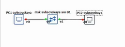
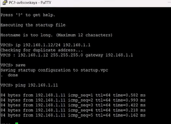
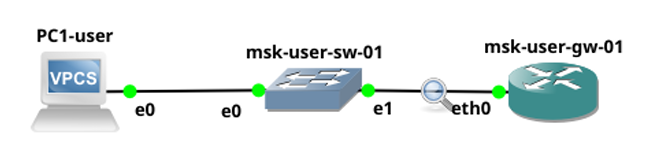
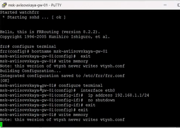
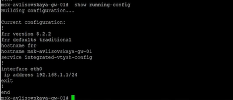
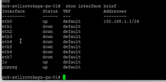
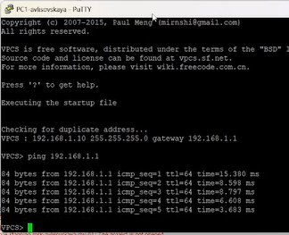
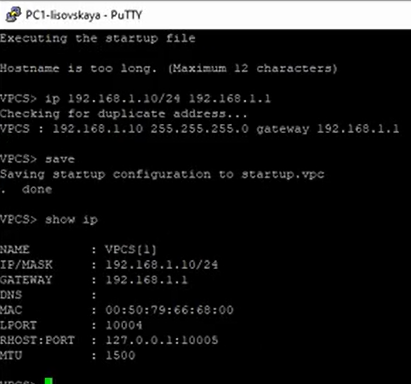
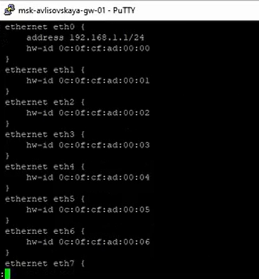

---
## Front matter
title: "Лабораторная работа №5"
subtitle: "Отчет"
author: "Лисовская Арина Валерьевна"

## Generic otions
lang: ru-RU
toc-title: "Содержание"

## Bibliography
bibliography: bib/cite.bib
csl: pandoc/csl/gost-r-7-0-5-2008-numeric.csl

## Pdf output format
toc: true # Table of contents
toc-depth: 2
lof: true # List of figures
lot: false # List of tables
fontsize: 12pt
linestretch: 1.5
papersize: a4
documentclass: scrreprt

## I18n polyglossia
polyglossia-lang:
  name: russian
  options:
  - spelling=modern
  - babelshorthands=true
polyglossia-otherlangs:
  name: english

## I18n babel
babel-lang: russian
babel-otherlangs: english

## Fonts
mainfont: PT Serif
romanfont: PT Serif
sansfont: PT Sans
monofont: PT Mono
mainfontoptions: Ligatures=TeX
romanfontoptions: Ligatures=TeX
sansfontoptions: Ligatures=TeX,Scale=MatchLowercase
monofontoptions: Scale=MatchLowercase,Scale=0.9

## Biblatex
biblatex: true
biblio-style: "gost-numeric"
biblatexoptions:
- parentracker=true
- backend=biber
- hyperref=auto
- language=auto
- autolang=other*
- citestyle=gost-numeric

## Pandoc-crossref LaTeX customization
figureTitle: "Рис."
tableTitle: "Таблица"
listingTitle: "Листинг"
lofTitle: "Список иллюстраций"
lotTitle: "Список таблиц"
lolTitle: "Листинги"

## Misc options
indent: true
header-includes:
- \usepackage{indentfirst}
- \usepackage{float} # keep figures where there are in the text
- \floatplacement{figure}{H} # keep figures where there are in the text
---

# Цель работы

Построение простейших моделей сети на базе коммутатора и маршрутизаторов FRR и VyOS в GNS3, анализ трафика посредством Wireshark.

# Задание

1.  Моделирование простейшей сети на базе коммутатора в GNS3.
2.  Анализ трафика в GNS3 посредством Wireshark (ARP, ICMP).
3.  Моделирование простейшей сети на базе маршрутизатора FRR в GNS3.
4.  Моделирование простейшей сети на базе маршрутизатора VyOS в GNS3.

# Выполнение лабораторной работы

## Моделирование сети на базе коммутатора

В начале работы я создаю топологию сети в GNS3, состоящую из двух виртуальных ПК (VPCS) и одного коммутатора Ethernet. Устройства соединяются интерфейсами, и я запускаю эмуляцию (рис. [-@fig:001]).

{#fig:001 width=70% height=70%}

Далее перехожу к настройке второго оконечного устройства (PC2). В терминале PuTTY выполняется процесс загрузки эмулятора VPCS. Командой `ip 192.168.1.12/24 192.168.1.1` присваиваю устройству IP-адрес 192.168.1.12 в сети 192.168.1.0/24 с указанием шлюза. Система проверяет адрес на уникальность, после чего я сохраняю конфигурацию командой `save` (рис. [-@fig:002]).

{#fig:002 width=70% height=70%}

Аналогичную настройку выполняю для первого виртуального ПК (PC1). Ввожу команду `ip 192.168.1.11/24 192.168.1.1`, присваивая адрес 192.168.1.11. Это завершает базовую конфигурацию сети из двух ПК и коммутатора, конфигурация также сохраняется (рис. [-@fig:003]).

{#fig:003 width=70% height=70%}

После настройки обоих ПК выполняю проверку работоспособности сети с первого узла. Команда `ping 192.168.1.12`, отправленная с PC1 (192.168.1.11) на PC2, получает успешные ответы. В выводе видны метрики `ttl=64` и время задержки около 1 мс, что свидетельствует о прямой связи в одной подсети через коммутатор (рис. [-@fig:004]).

{#fig:004 width=70% height=70%}

Затем проверяю связь в обратном направлении. В терминале второго ПК (PC2) ввожу команду `ping 192.168.1.11`. Пинг проходит успешно, что подтверждает корректную двустороннюю связь и правильную работу коммутации кадров (рис. [-@fig:005]).

{#fig:005 width=70% height=70%}

Для анализа трафика я запускаю захват пакетов в Wireshark на линке между PC1 и коммутатором. В окне анализатора отображаются перехваченные кадры, включая протоколы ARP и ICMPv6, что позволяет детально изучить процесс сетевого взаимодействия (рис. [-@fig:006]).

{#fig:006 width=70% height=70%}

Также просматриваю детальную информацию о захваченном пакете в нижней панели Wireshark. Здесь отображается шестнадцатеричный дамп кадра и расшифровка заголовков уровней модели OSI (рис. [-@fig:007]).

{#fig:007 width=70% height=70%}

## Моделирование сети на базе маршрутизатора FRR

Перехожу к выполнению задания с маршрутизатором FRR. Строю в GNS3 новую топологию, включающую PC1, коммутатор и маршрутизатор FRR (`msk-user-gw-01`), соединенные соответствующими интерфейсами (рис. [-@fig:008]).

{#fig:008 width=70% height=70%}

Выполняю базовую конфигурацию маршрутизатора FRR через консоль. Вхожу в режим конфигурации (`configure terminal`), меняю имя хоста на `msk-avlisovskaya-gw-01`. Затем настраиваю интерфейс eth0: назначаю IP-адрес 192.168.1.1/24 и включаю интерфейс командой `no shutdown`. Конфигурация сохраняется командой `write memory` (рис. [-@fig:009]).

{#fig:009 width=70% height=70%}

Проверяю текущую конфигурацию устройства командой `show running-config`. В выводе видно, что имя хоста успешно изменено, а интерфейсу eth0 присвоен корректный IP-адрес (рис. [-@fig:010]).

{#fig:010 width=70% height=70%}

Дополнительно проверяю состояние интерфейсов командой `show interface brief`. Интерфейс eth0 находится в статусе `up`, ему присвоен адрес 192.168.1.1/24, что подтверждает его готовность к работе (рис. [-@fig:011]).

{#fig:011 width=70% height=70%}

После настройки маршрутизатора проверяю связь между PC1 и шлюзом. С узла PC1 (192.168.1.10) выполняю `ping 192.168.1.1`. Успешные ответы подтверждают, что маршрутизатор отвечает на интерфейсе eth0, и стек TCP/IP настроен верно (рис. [-@fig:012]).

{#fig:012 width=70% height=70%}

Анализирую трафик на соединении с маршрутизатором. В Wireshark видны пакеты ARP (Gratuitous ARP от PC1) и запросы маршрутизатора (Router Solicitation). Это демонстрирует процессы разрешения адресов на канальном уровне перед началом обмена IP-пакетами (рис. [-@fig:013]).

{#fig:013 width=70% height=70%}

## Моделирование сети на базе маршрутизатора VyOS

Перехожу к последней части работы — настройке сети с маршрутизатором VyOS. Схема сети аналогична предыдущей, но в качестве шлюза используется образ VyOS (рис. [-@fig:014]).

{#fig:014 width=70% height=70%}

Подготавливаю оконечное устройство PC1. Назначаю ему IP-адрес 192.168.1.10 и проверяю настройки командой `show ip`. Вывод подтверждает корректность IP-адреса, маски и шлюза (рис. [-@fig:015]).

{#fig:015 width=70% height=70%}

Выполняю настройку интерфейса маршрутизатора VyOS. В режиме конфигурации использую команду `set interfaces ethernet eth0 address 192.168.1.1/24`. После этого проверяю изменения через `compare` и применяю их ключевой командой `commit`, так как в VyOS изменения не вступают в силу без подтверждения (рис. [-@fig:016]).

{#fig:016 width=70% height=70%}

Просматриваю итоговую конфигурацию VyOS. В секции ethernet eth0 прописан адрес 192.168.1.1/24, также видны физические адреса интерфейсов. Это подтверждает успешное применение настроек (рис. [-@fig:017]).

{#fig:017 width=70% height=70%}

Выполняю финальную проверку связи. С PC1 запускаю пинг до шлюза VyOS (192.168.1.1). Ответы приходят с минимальной задержкой (time=0.509 ms), что свидетельствует о правильной настройке всей сетевой схемы (рис. [-@fig:018]).

{#fig:018 width=70% height=70%}

В завершение анализирую "живой" трафик ICMP в Wireshark. Видны запросы `Echo (ping) request` от PC1 и ответы `reply` от маршрутизатора. Также зафиксирован процесс ARP (запрос MAC-адреса PC1 маршрутизатором), необходимый для инкапсуляции IP-пакета в Ethernet-кадр (рис. [-@fig:019]).

{#fig:019 width=70% height=70%}

# Выводы

В ходе выполнения лабораторной работы я построила и изучила простейшие модели сетей в среде GNS3. Были приобретены навыки настройки IP-адресации на виртуальных ПК (VPCS), а также базовой конфигурации программных маршрутизаторов FRR и VyOS (назначение адресов, управление интерфейсами). С помощью анализатора Wireshark я изучила структуру сетевого трафика, наблюдая работу протоколов ARP и ICMP на практике.