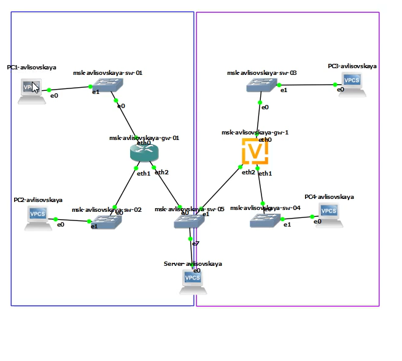
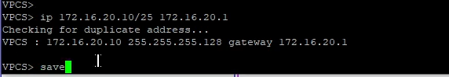
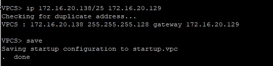
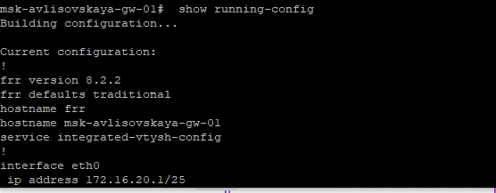
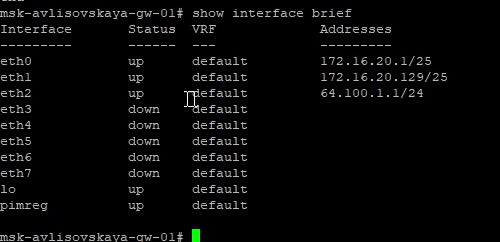
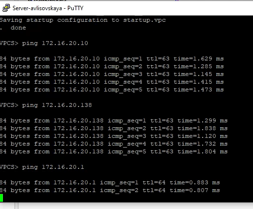
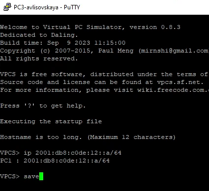
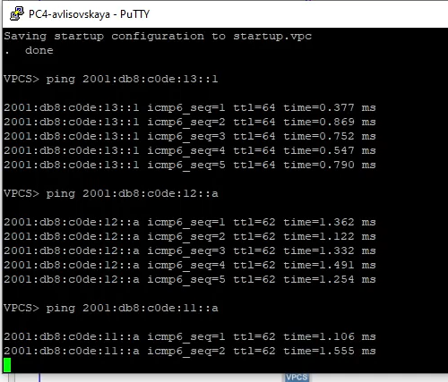
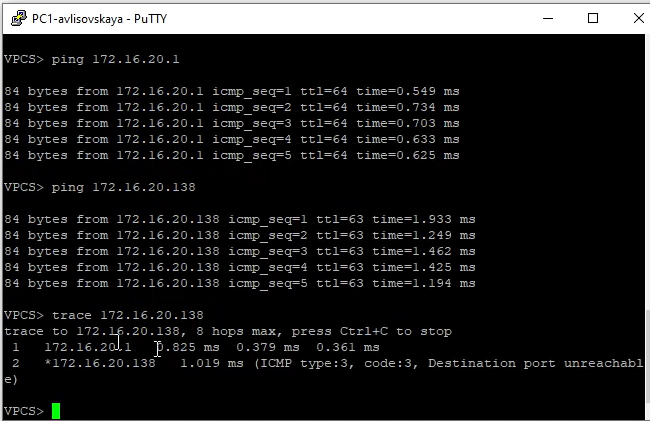
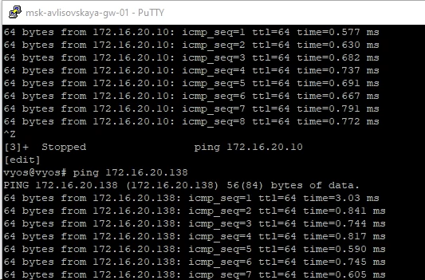

---
## Front matter
lang: ru-RU
title: Лабораторная работа №6
subtitle: "Адресация IPv4 и IPv6. Двойной стек"
author:
  - Лисовская А. В.
institute:
  - Российский университет дружбы народов, Москва, Россия
date: 2026 г.

## i18n babel
babel-lang: russian
babel-otherlangs: english

## Formatting pdf
toc: false
toc-title: Содержание
slide_level: 2
aspectratio: 169
section-titles: true
theme: metropolis
header-includes:
 - \metroset{progressbar=frametitle,sectionpage=progressbar,numbering=fraction}
 - \makeatletter
 - \beamer@ignorenonframefalse
 - \makeatother

## Fonts
mainfont: PT Serif
romanfont: PT Serif
sansfont: PT Sans
monofont: PT Mono
mainfontoptions: Ligatures=TeX
romanfontoptions: Ligatures=TeX
sansfontoptions: Ligatures=TeX,Scale=MatchLowercase
monofontoptions: Scale=MatchLowercase,Scale=0.9
---

## Докладчик

:::::::::::::: {.columns align=center}
::: {.column width="70%"}

  * Лисовская Арина Валерьевна
  * Студентка учебной группы
  * Российский университет дружбы народов
  * Факультет физико-математических и естественных наук

:::
::: {.column width="30%"}

:::
::::::::::::::

# Вводная часть

## Цель работы

* Изучение принципов распределения и настройки адресного пространства на устройствах сети.
* Освоение технологий работы с протоколами IPv4 и IPv6.
* Настройка и проверка работы режима двойного стека (Dual Stack).

## Задачи

1. Создать сетевую топологию в среде GNS3.
2. Выполнить настройку IPv4 на оконечных узлах и сервере.
3. Сконфигурировать интерфейсы маршрутизатора FRR для разных подсетей.
4. Проверить связность сети (локальную и внешнюю).
5. Проанализировать работу IPv6 и механизмов разрешения адресов (ARP/NDP).

# Выполнение работы

## Создание топологии

Собрана схема сети, включающая маршрутизатор `msk-avlisovskaya-gw-01`, коммутаторы, два сегмента локальной сети и сервер.

{width=60%}

## Настройка оконечных узлов PC1 и PC2

Настроены статические IPv4-адреса для разных подсетей: PC1 (`172.16.20.10/25`) и PC2 (`172.16.20.138/25`).

:::::::::::::: {.columns align=center}
::: {.column width="50%"}
{width=100%}
:::
::: {.column width="50%"}
{width=100%}
:::
::::::::::::::

## Конфигурация маршрутизатора: Системные параметры

Выполнен вход в режим конфигурации и установка имени хоста устройства.

{width=70%}

## Конфигурация маршрутизатора: Интерфейсы eth0 и eth1

Настроены внутренние интерфейсы, выступающие в роли шлюзов для локальных подсетей.

{width=70%}
{width=70%}

## Конфигурация маршрутизатора: eth2 и проверка

Настроен внешний интерфейс `eth2` (64.100.1.1) и проверен итоговый статус всех портов.

:::::::::::::: {.columns align=center}
::: {.column width="50%"}
{width=100%}
:::
::: {.column width="50%"}
{width=100%}
:::
::::::::::::::

## Верификация PC1: IPv4 и IPv6

Проверено наличие Link-Local адреса IPv6 и корректность IPv4-параметров.

{width=70%}
{width=70%}

## Тестирование связности PC1

Выполнены пинги до соседней подсети (PC2), своего шлюза и внешней сети.

{width=70%}
{width=70%}

## Настройка и проверка сервера

Сервер настроен и проверен на связность со всеми сегментами сети.

{width=60%}
{width=60%}

## Анализ трафика и ICMP

Проанализирован процесс прохождения пакетов через маршрутизатор (TTL=63) и работа протокола ARP.

{width=70%}
{width=70%}

## Работа Dual Stack и IPv6

Зафиксирована работа протокола NDP (Neighbor Discovery) и автоматическая адресация IPv6.

{width=70%}
{width=70%}

# Заключение

## Выводы

* Изучены принципы разделения сети на подсети с использованием масок переменной длины.
* Настроена маршрутизация между IPv4-сегментами на базе FRR.
* Экспериментально подтверждена работа "двойного стека" (IPv4/IPv6).
* Проанализированы механизмы ICMP и разрешение адресов в сетях разного типа.