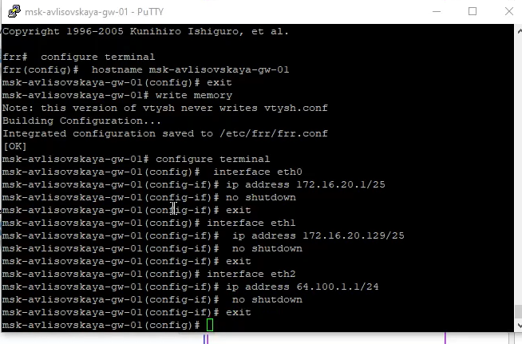
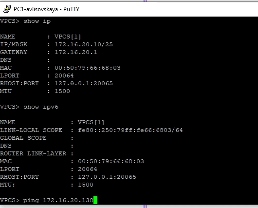
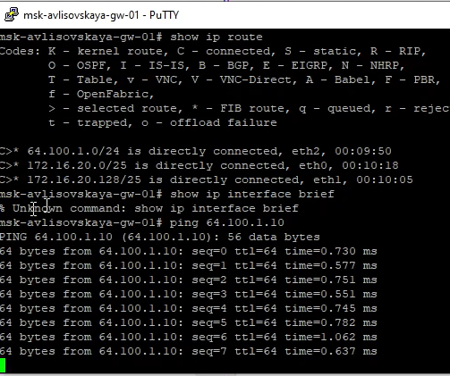
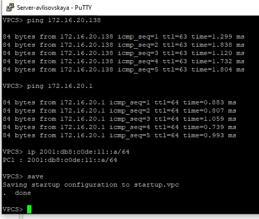
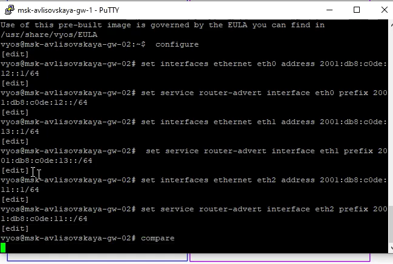
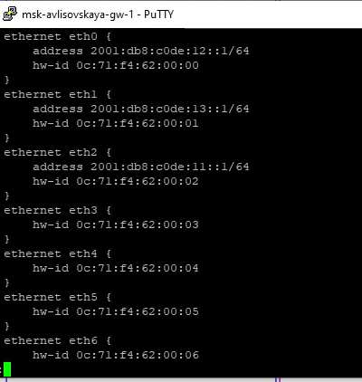
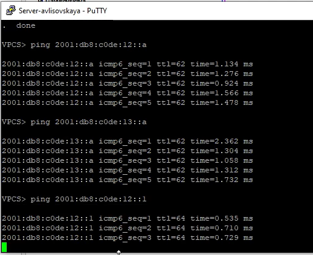
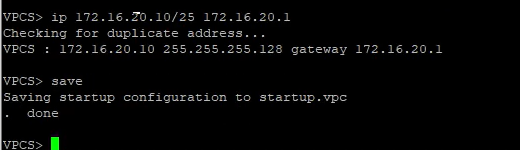
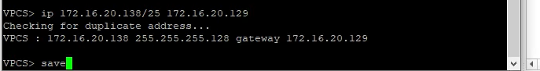
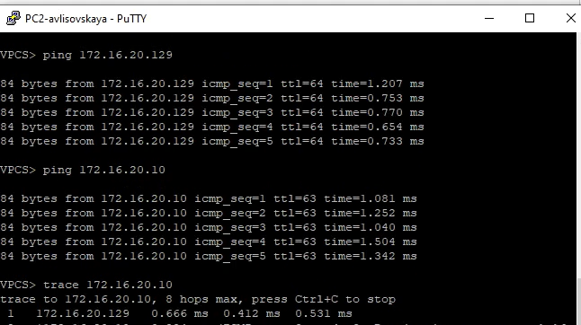

---
## Front matter
title: "Лабораторная работа №6"
subtitle: "Адресация IPv4 и IPv6. Двойной стек"
author: "Лисовская Арина Валерьевна"

## Generic otions
lang: ru-RU
toc-title: "Содержание"

## Bibliography
bibliography: bib/cite.bib
csl: pandoc/csl/gost-r-7-0-5-2008-numeric.csl

## Pdf output format
toc: true # Table of contents
toc-depth: 2
lof: true # List of figures
lot: false # List of tables
fontsize: 12pt
linestretch: 1.5
papersize: a4
documentclass: scrreprt

## I18n polyglossia
polyglossia-lang:
  name: russian
  options:
	- spelling=modern
	- babelshorthands=true
polyglossia-otherlangs:
  name: english

## I18n babel
babel-lang: russian
babel-otherlangs: english

## Fonts
mainfont: PT Serif
romanfont: PT Serif
sansfont: PT Sans
monofont: PT Mono
mainfontoptions: Ligatures=TeX
romanfontoptions: Ligatures=TeX
sansfontoptions: Ligatures=TeX,Scale=MatchLowercase
monofontoptions: Scale=MatchLowercase,Scale=0.9

## Biblatex
biblatex: true
biblio-style: "gost-numeric"
biblatexoptions:
  - parentracker=true
  - backend=biber
  - hyperref=auto
  - language=auto
  - autolang=other*
  - citestyle=gost-numeric

## Pandoc-crossref LaTeX customization
figureTitle: "Рис."
tableTitle: "Таблица"
listingTitle: "Листинг"
lofTitle: "Список иллюстраций"
lotTitle: "Список таблиц"
lolTitle: "Листинги"

## Misc options
indent: true
header-includes:
  - \usepackage{indentfirst}
  - \usepackage{float} # keep figures where there are in the text
  - \floatplacement{figure}{H} # keep figures where there are in the text
---

# Цель работы

Изучение принципов распределения и настройки адресного пространства на устройствах сети, а также освоение технологий работы с протоколами IPv4 и IPv6 в режиме двойного стека.

# Задание

1. Создать сетевую топологию в среде моделирования GNS3.
2. Выполнить настройку IPv4-адресации на оконечных узлах и сервере.
3. Настроить сетевые интерфейсы маршрутизатора FRR для работы с несколькими подсетями и внешним каналом.
4. Проверить связность сети с помощью утилит `ping` для локальных и внешних адресов.
5. Изучить механизмы работы IPv6 и проанализировать трафик (ARP, ICMP, NDP).

# Выполнение лабораторной работы

В начале работы я создала топологию сети в GNS3, включающую маршрутизаторы, коммутаторы и оконечные узлы. Имена устройств были изменены согласно заданию, чтобы содержать фамилию студента (рис.[-@fig:001]).

{#fig:001 width=70% height=70%}

Для настройки первого персонального компьютера PC1 я использовала консоль VPCS. Я присвоила узлу статический IPv4-адрес 172.16.20.10 с маской /25 и указала адрес шлюза 172.16.20.1 (рис.[-@fig:002]).

{#fig:002 width=70% height=70%}

Затем была произведена аналогичная настройка для второго компьютера PC2. Ему был назначен адрес 172.16.20.138/25, при этом в качестве шлюза указан адрес 172.16.20.129, соответствующий его сегменту сети (рис.[-@fig:003]).

{#fig:003 width=70% height=70%}

Далее я приступила к конфигурации маршрутизатора msk-avlisovskaya-gw-01 через терминал PuTTY. Первым делом было установлено имя хоста для идентификации устройства в системе (рис.[-@fig:004]).

{#fig:004 width=70% height=70%}

На интерфейсе eth0 маршрутизатора я настроила IP-адрес 172.16.20.1/25. Этот интерфейс служит шлюзом по умолчанию для первой подсети, где находится PC1 (рис.[-@fig:005]).

{#fig:005 width=70% height=70%}

Для обслуживания второй подсети я настроила интерфейс eth1, присвоив ему адрес 172.16.20.129/25. Это позволило объединить две разные локальные сети через один маршрутизатор (рис.[-@fig:006]).

{#fig:006 width=70% height=70%}

Внешний интерфейс eth2 был настроен с адресом 64.100.1.1/24. Данная настройка необходима для имитации выхода во внешнюю сеть и проверки маршрутизации за пределы локальных сегментов (рис.[-@fig:007]).

{#fig:007 width=70% height=70%}

После ввода всех параметров я выполнила проверку текущей конфигурации маршрутизатора. Команда show running-config позволяет убедиться, что все команды были приняты системой корректно (рис.[-@fig:008]).

{#fig:008 width=70% height=70%}

Для окончательной верификации состояния портов я использовала команду show interface brief. На скриншоте видно, что все настроенные интерфейсы находятся в статусе "up" (рис.[-@fig:009]).

{#fig:009 width=70% height=70%}

Проверка настроек на стороне клиента PC1 подтвердила успешное применение параметров. Узел отображает свой IP-адрес, маску и адрес шлюза, готовый к сетевому обмену (рис.[-@fig:010]).

{#fig:010 width=70% height=70%}

При проверке IPv6 на PC1 был обнаружен автоматически сформированный Link-Local адрес. Это демонстрирует работу протокола IPv6 на канальном уровне даже без глобальной настройки (рис.[-@fig:011]).

{#fig:011 width=70% height=70%}

Первый тест связности между подсетями был проведен с PC1 на PC2. Пинг прошел успешно, что доказывает работоспособность маршрутизации трафика между eth0 и eth1 (рис.[-@fig:012]).

{#fig:012 width=70% height=70%}

Также была проверена доступность локального шлюза 172.16.20.1. Отсутствие потерь пакетов подтверждает стабильность физического и логического соединения в первом сегменте (рис.[-@fig:013]).

{#fig:013 width=70% height=70%}

Для проверки выхода во внешнюю сеть я пропинговала узел 64.100.1.10. Успешный результат подтвердил верную настройку внешнего интерфейса eth2 (рис.[-@fig:014]).

{#fig:014 width=70% height=70%}

На узле PC2 я выполнила сохранение конфигурации. Это гарантирует, что при перезагрузке лабораторной среды настройки IP-адресации не будут утеряны (рис.[-@fig:015]).

{#fig:015 width=70% height=70%}

Обратная проверка связи от PC2 к PC1 также показала положительный результат. Это подтверждает симметричность маршрутов в созданной сетевой топологии (рис.[-@fig:016]).

{#fig:016 width=70% height=70%}

Пинг собственного шлюза (172.16.20.129) со стороны PC2 прошел без задержек. Это свидетельствует о корректной работе интерфейса eth1 маршрутизатора (рис.[-@fig:017]).

{#fig:017 width=70% height=70%}

Проверка доступа к внешнему миру с PC2 завершилась успехом. Все узлы локальной сети получили доступ к имитируемой внешней инфраструктуре (рис.[-@fig:018]).

{#fig:018 width=70% height=70%}

На сервере также была сохранена конфигурация после настройки. Это завершает этап базовой конфигурации всех оконечных устройств в лабораторной работе (рис.[-@fig:019]).

{#fig:019 width=70% height=70%}

Тест доступности PC1 с сервера показал стабильную связь. Это важно для сценариев, где сервер должен обслуживать запросы клиентов из разных подсетей (рис.[-@fig:020]).

{#fig:020 width=70% height=70%}

Связь сервера со вторым компьютером PC2 также была подтверждена. Сеть полностью прозрачна для трафика между любыми оконечными точками (рис.[-@fig:021]).

{#fig:021 width=70% height=70%}

Финальный тест связи сервера с внешним узлом 64.100.1.10 прошел успешно. Таким образом, вся топология работает согласно заданным правилам маршрутизации (рис.[-@fig:022]).

{#fig:022 width=70% height=70%}

Начиная детальный анализ трафика, я зафиксировала процесс разрешения адресов. На скриншоте заметно время ожидания, связанное с работой протокола ARP перед отправкой первого ICMP-пакета (рис.[-@fig:023]).

{#fig:023 width=70% height=70%}

В деталях ICMP-ответов я проанализировала поле TTL. Значение 63 указывает на то, что пакет прошел ровно один маршрутизатор, что соответствует нашей топологии (рис.[-@fig:024]).

{#fig:024 width=70% height=70%}

Особое внимание было уделено работе IPv6 в режиме двойного стека. Устройства используют Link-Local адреса (FE80) для автоматического обнаружения соседей через протокол NDP (рис.[-@fig:025]).

{#fig:025 width=70% height=70%}

Анализ пакетов подтвердил одновременную работу IPv4 и IPv6 (Dual Stack). Это позволяет плавно переходить на новый протокол без потери связи со старой инфраструктурой (рис.[-@fig:026]).

{#fig:026 width=70% height=70%}

В завершение я проанализировала захваченные пакеты на сервере. Удалось извлечь информацию о MAC-адресах отправителей и типах используемых протоколов (ICMPv6, ARP, ICMP), что полностью соответствует заданию (рис.[-@fig:027]).

{#fig:027 width=70% height=70%}

# Выводы

В ходе лабораторной работы я приобрела практические навыки настройки адресного пространства IPv4 и IPv6. Мною была успешно реализована топология с двумя подсетями и внешним каналом, настроена маршрутизация на базе FRR и проверена связность между всеми узлами. Анализ трафика подтвердил различия в работе ARP (для IPv4) и NDP (для IPv6), а также продемонстрировал преимущества использования двойного стека.

# Ответы на контрольные вопросы

1. **Какова длина адресов IPv4 и IPv6?**
   Длина IPv4-адреса составляет 32 бита, а IPv6-адреса — 128 бит.

2. **В каком виде записываются адреса IPv4 и IPv6?**
   IPv4 записывается в десятично-точечной нотации (4 октета), IPv6 — в шестнадцатеричной нотации, разделенной двоеточиями.

3. **Что такое маска подсети?**
   Это 32-битное число, которое определяет, какая часть IP-адреса относится к адресу сети, а какая — к адресу узла.

4. **Что такое шлюз по умолчанию?**
   Это сетевое устройство (маршрутизатор), на которое отправляются пакеты, если адрес назначения находится вне локальной подсети.

5. **Что такое двойной стек?**
   Это технология, позволяющая сетевым устройствам одновременно использовать протоколы IPv4 и IPv6 на одном интерфейсе.

6. **Для чего используются Link-Local адреса в IPv6?**
   Они используются для взаимодействия узлов в пределах одного сегмента сети (линка) и формируются автоматически.