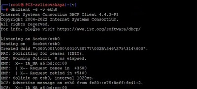
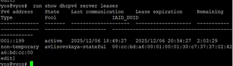

---
## Front matter
lang: ru-RU
title: Лабораторная работа №7
subtitle: "Адресация IPv4 и IPv6. Настройка DHCP"
author:
  - Лисовская А.В.
institute:
  - Российский университет дружбы народов, Москва, Россия
date: 4 февраля 2026

## i18n babel
babel-lang: russian
babel-otherlangs: english

## Formatting pdf
toc: false
toc-title: Содержание
slide_level: 2
aspectratio: 169
section-titles: true
theme: metropolis
header-includes:
 - \metroset{progressbar=frametitle,sectionpage=progressbar,numbering=fraction}
 - '\makeatletter'
 - '\beamer@ignorenonframefalse'
 - '\makeatother'

## Fonts
mainfont: PT Serif
romanfont: PT Serif
sansfont: PT Sans
monofont: PT Mono
mainfontoptions: Ligatures=TeX
romanfontoptions: Ligatures=TeX
sansfontoptions: Ligatures=TeX,Scale=MatchLowercase
monofontoptions: Scale=MatchLowercase,Scale=0.9
---

## Докладчик

:::::::::::::: {.columns align=center}
::: {.column width="70%"}

  * Лисовская Арина Валерьевна
  * Студентка группы НПИбд01-23
  * Российский университет дружбы народов
  * [1132236894@pfur.ru](mailto:1132236894@pfur.ru)

:::
::: {.column width="30%"}

:::
::::::::::::::

## Цель работы

* Изучение принципов работы протокола DHCP (Dynamic Host Configuration Protocol).
* Получение практических навыков настройки службы DHCP на сетевом оборудовании.
* Организация автоматического распределения адресов IPv4 и IPv6 в локальной сети.
* Анализ механизмов Stateful и Stateless для IPv6.

## Теоретическое введение

* **DHCP** — протокол, позволяющий устройствам автоматически получать IP-адрес и параметры сети (шлюз, DNS).
* **Модель работы**: Клиент-сервер (UDP порты 67/68 для IPv4, 546/547 для IPv6).
* **DHCPv6**:
    * **Stateless**: Клиент получает префикс через RA (Router Advertisement), а доп. параметры через DHCP.
    * **Stateful**: Сервер полностью управляет выдачей адресов и хранит информацию о состоянии (leases).

## Настройка инфраструктуры

* В качестве сетевого оборудования используется маршрутизатор под управлением VyOS.
* Клиентские узлы представлены виртуальными машинами (PC).
* Основная задача: настроить маршрутизатор как DHCP-сервер для сегмента сети.

## Выполнение работы: Настройка IPv4 DHCP

* Определение пула адресов и исключение статических IP.
* Указание параметров сети:
    * Сетевой адрес и маска.
    * Шлюз по умолчанию (Default Router).
    * Адреса DNS-серверов.
* Привязка DHCP-сервера к конкретному интерфейсу маршрутизатора.

## Выполнение работы: Конфигурация Stateful DHCPv6

* Создание пула адресов для IPv6.
* Настройка диапазона выдачи (например, `2001::100` – `2001::199`).
* Настройка интерфейса `eth1` маршрутизатора:
    * Включение флагов `managed-config` и `other-config` в Router Advertisement.
    * Это заставляет клиентов запрашивать адрес именно у DHCPv6 сервера.

{width=60%}

## Проверка на стороне клиента (PC3)

* Для получения адреса на клиенте использовалась утилита `udhcpc6`.
* Команда: `udhcpc6 -i eth0`.
* Результат: интерфейс получил адрес из заданного диапазона и настройки DNS.

{width=60%}

## Контроль состояния сервера

* Проверка таблицы аренды (lease table) на маршрутизаторе.
* Команда: `show dhcpv6 server leases`.
* В выводе отображается выданный IPv6-адрес, DUID клиента и время истечения аренды.

{width=65%}

## Анализ трафика в Wireshark (Neighbor Discovery)

* Исследование протокола ICMPv6.
* Анализ пакетов *Router Solicitation* и *Router Advertisement*.
* Проверка флагов в RA пакетах, которые определяют режим работы DHCPv6.

{width=65%}

## Анализ обмена сообщениями DHCPv6

* Визуализация процесса из 4 шагов (SOLICIT, ADVERTISE, REQUEST, REPLY).
* Анализ структуры пакетов: наличие опций DNS и доменного поиска.
* Проверка соответствия МАС-адресов и DUID.

{width=65%}

## Результаты работы

* Настроен полнофункциональный DHCP-сервер для IPv4 и IPv6.
* Реализована схема Stateful DHCPv6, обеспечивающая строгий контроль распределения адресов.
* Проведена верификация настроек: клиенты успешно получают доступ к сети и могут разрешать имена через DNS.
* С помощью Wireshark подтверждена теоретическая база работы протоколов динамической конфигурации.

## Выводы

1. DHCP является критически важным протоколом для масштабируемых сетей, минимизируя ошибки ручной настройки.
2. Механизмы IPv6 предлагают гибкость (Stateless/Stateful), что отличает их от классического IPv4 DHCP.
3. Навыки работы с CLI маршрутизатора и анализаторами трафика позволяют эффективно диагностировать сетевые неполадки.