---
## Front matter
title: "Лабораторная работа №7"
subtitle: "Отчет"
author: "Лисовская Арина Валерьевна"

## Generic otions
lang: ru-RU
toc-title: "Содержание"

## Bibliography
bibliography: bib/cite.bib
csl: pandoc/csl/gost-r-7-0-5-2008-numeric.csl

## Pdf output format
toc: true # Table of contents
toc-depth: 2
lof: true # List of figures
lot: false # List of tables
fontsize: 12pt
linestretch: 1.5
papersize: a4
documentclass: scrreprt

## I18n polyglossia
polyglossia-lang:
  name: russian
  options:
	- spelling=modern
	- babelshorthands=true
polyglossia-otherlangs:
  name: english

## I18n babel
babel-lang: russian
babel-otherlangs: english

## Fonts
mainfont: PT Serif
romanfont: PT Serif
sansfont: PT Sans
monofont: PT Mono
mainfontoptions: Ligatures=TeX
romanfontoptions: Ligatures=TeX
sansfontoptions: Ligatures=TeX,Scale=MatchLowercase
monofontoptions: Scale=MatchLowercase,Scale=0.9

## Biblatex
biblatex: true
biblio-style: "gost-numeric"
biblatexoptions:
  - parentracker=true
  - backend=biber
  - hyperref=auto
  - language=auto
  - autolang=other*
  - citestyle=gost-numeric

## Pandoc-crossref LaTeX customization
figureTitle: "Рис."
tableTitle: "Таблица"
listingTitle: "Листинг"
lofTitle: "Список иллюстраций"
lotTitle: "Список таблиц"
lolTitle: "Листинги"

## Misc options
indent: true
header-includes:
  - \usepackage{indentfirst}
  - \usepackage{float} # keep figures where there are in the text
  - \floatplacement{figure}{H} # keep figures where there are in the text
---

# Цель работы

Получение навыков настройки службы DHCP на сетевом оборудовании для распределения адресов IPv4 и IPv6.

# Задание

1.  Настроить DHCP-сервис на маршрутизаторе VyOS для распределения IPv4-адресов.
2.  Настроить получение адреса по DHCP на клиенте и исследовать пакеты.
3.  Настроить DHCPv6 в режиме Stateless (без отслеживания состояния).
4.  Настроить DHCPv6 в режиме Stateful (с отслеживанием состояния).

# Выполнение лабораторной работы

## Настройка DHCP для IPv4

В среде GNS3 была собрана топология сети, состоящая из маршрутизатора VyOS, коммутатора и хоста VPCS. На рисунке [-@fig:001] представлена начальная топология для выполнения первой части работы.

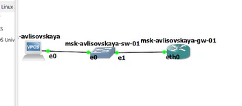{#fig:001 width=70% height=70%}

Далее была произведена базовая настройка маршрутизатора. На рисунке [-@fig:002] показан процесс установки имени хоста в режиме конфигурации.

{#fig:002 width=70% height=70%}

После внесения изменений конфигурация была сохранена, осуществлен выход из режима настройки (рис. [-@fig:003]).

{#fig:003 width=70% height=70%}

Для продолжения работы был выполнен вход в систему под пользователем `avlisovskaya`, чтобы подтвердить возможность работы под созданной учетной записью (рис. [-@fig:004]).

{#fig:004 width=70% height=70%}

В целях безопасности стандартный пользователь `vyos` был удален из системы (рис. [-@fig:005]).

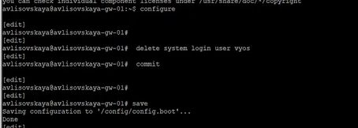{#fig:005 width=70% height=70%}

Следующим шагом стала настройка сетевого интерфейса. На интерфейсе `eth0` был задан статический IPv4-адрес `10.0.0.1/24`, который будет выступать шлюзом для локальной сети (рис. [-@fig:006]).

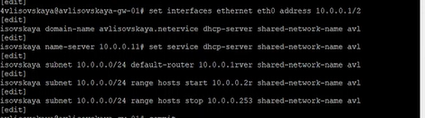{#fig:006 width=70% height=70%}

Была произведена настройка DHCP-сервера для IPv4. Был создан пул адресов (10.0.0.2 – 10.0.0.253), указаны шлюз по умолчанию и DNS-сервер (рис. [-@fig:007]).

{#fig:007 width=70% height=70%}

После применения настроек была проверена статистика сервера. На рисунке [-@fig:008] видно, что сервер активен, но арендованных адресов пока нет.

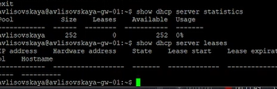{#fig:008 width=70% height=70%}

На клиенте VPCS была запущена команда для получения IP-адреса. На рисунке [-@fig:009] виден процесс DORA (Discover, Offer, Request, Ack), где клиент отправляет широковещательный запрос.

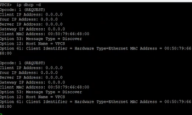{#fig:009 width=70% height=70%}

Проверка на стороне клиента показала, что адрес `10.0.0.2` успешно получен. Также была проверена сетевая доступность шлюза с помощью команды ping (рис. [-@fig:010]).

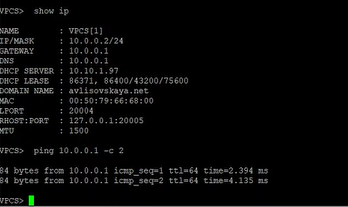{#fig:010 width=70% height=70%}

Повторная проверка статистики на маршрутизаторе подтвердила выдачу адреса. В таблице аренд (leases) появилась запись для MAC-адреса клиента (рис. [-@fig:011]).

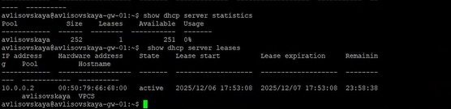{#fig:011 width=70% height=70%}

На рисунке [-@fig:012] представлен общий вид рабочего стола в процессе настройки.

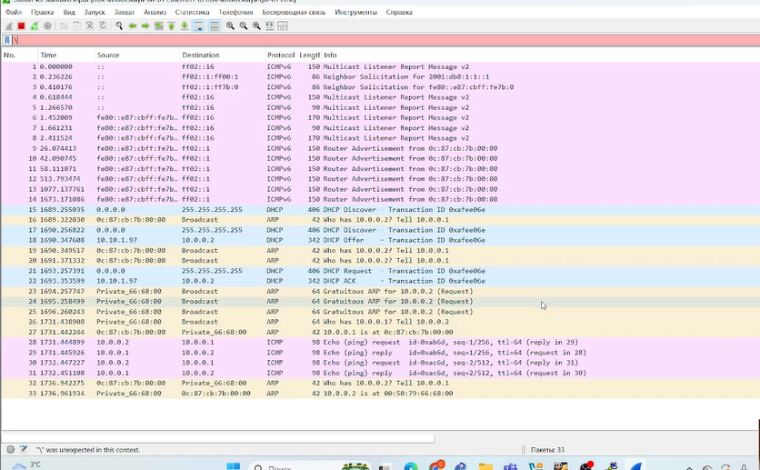{#fig:012 width=70% height=70%}

## Настройка DHCP для IPv6

Топология сети была расширена для работы с IPv6. Были добавлены клиенты PC2 и PC3 (Kali Linux), подключенные к разным интерфейсам маршрутизатора для тестирования разных режимов DHCPv6 (рис. [-@fig:013]).

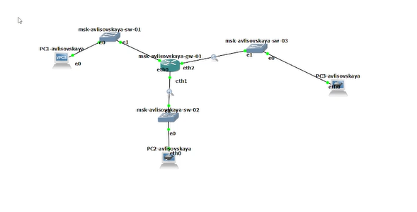{#fig:013 width=70% height=70%}

На интерфейсах маршрутизатора `eth1` и `eth2` были настроены IPv6-адреса `2000::1/64` и `2001::1/64` соответственно (рис. [-@fig:014]).

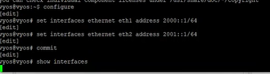{#fig:014 width=70% height=70%}

### Настройка DHCPv6 Stateless

На интерфейсе `eth1` был настроен режим DHCPv6 Stateless. В объявлениях маршрутизатора (RA) установлен флаг `other-config-flag`, что позволяет клиентам получать адрес через SLAAC, а остальные параметры (например, DNS) — через DHCPv6 (рис. [-@fig:015]).

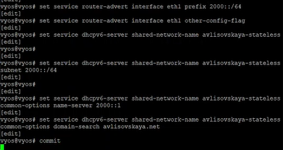{#fig:015 width=70% height=70%}

Команда `show configuration` позволила проверить корректность настроек интерфейсов перед продолжением работы (рис. [-@fig:016]).

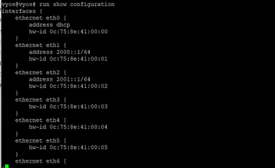{#fig:016 width=70% height=70%}

На клиенте PC2 была проверена автоматическая настройка адреса. Вывод `ifconfig` показывает наличие IPv6-адреса, полученного через механизм SLAAC (рис. [-@fig:017]).

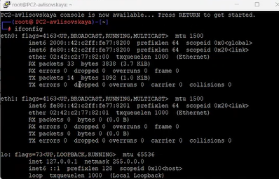{#fig:017 width=70% height=70%}

В таблице маршрутизации клиента PC2 присутствует маршрут по умолчанию через link-local адрес маршрутизатора (рис. [-@fig:018]).

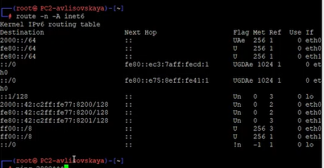{#fig:018 width=70% height=70%}

С клиента PC2 была проверена доступность маршрутизатора по адресу `2000::1`. Пинг проходит успешно (рис. [-@fig:019]).

{#fig:019 width=70% height=70%}

Для получения дополнительных параметров (DNS) на клиенте был запущен DHCPv6-клиент в режиме запроса информации (stateless) (рис. [-@fig:020]).

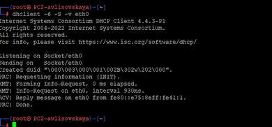{#fig:020 width=70% height=70%}

Проверка файла `/etc/resolv.conf` подтвердила, что адрес DNS-сервера (`2000::1`) был успешно получен от сервера (рис. [-@fig:021]).

{#fig:021 width=70% height=70%}

На рисунке [-@fig:022] представлен вид терминала в процессе работы.

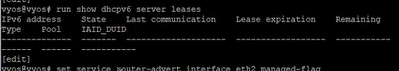{#fig:022 width=70% height=70%}

### Настройка DHCPv6 Stateful

На интерфейсе `eth2` был настроен режим DHCPv6 Stateful. Установлен флаг `managed-flag`, настроен пул адресов (2001::100 – 2001::199). В этом режиме сервер полностью управляет адресацией (рис. [-@fig:023]).

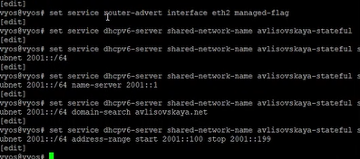{#fig:023 width=70% height=70%}

На клиенте PC3 перед запросом адреса был проверен интерфейс. Виден только link-local адрес, глобального адреса пока нет (рис. [-@fig:024]).

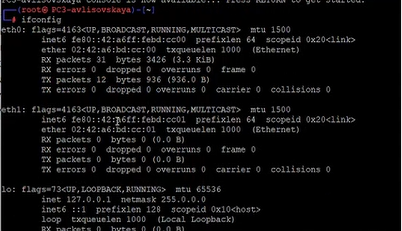{#fig:024 width=70% height=70%}

Таблица маршрутизации PC3 также подтверждает отсутствие глобальных маршрутов (рис. [-@fig:025]).

{#fig:025 width=70% height=70%}

Запущен процесс получения адреса через DHCPv6. На рисунке [-@fig:026] виден обмен сообщениями Solicit и Advertise, в результате которого клиент получает адрес от сервера.

{#fig:026 width=70% height=70%}

После получения настроек была проверена связь с маршрутизатором (`ping 2001::1`) и содержимое `/etc/resolv.conf`. Все параметры получены корректно (рис. [-@fig:027]).

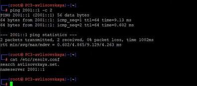{#fig:027 width=70% height=70%}

На маршрутизаторе была проверена статистика выдачи адресов. Адрес `2001::199` зафиксирован за клиентом в таблице аренды (рис. [-@fig:028]).

{#fig:028 width=70% height=70%}

## Анализ трафика

С помощью анализатора трафика Wireshark были перехвачены пакеты в сети. На рисунке [-@fig:029] видны сообщения ICMPv6, используемые для обнаружения соседей и маршрутизаторов.

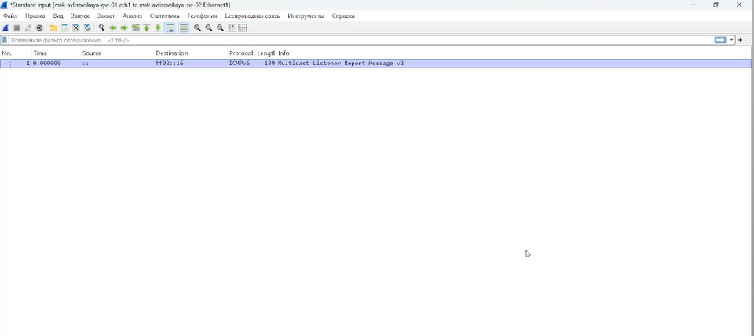{#fig:029 width=70% height=70%}

На рисунке [-@fig:030] представлен дополнительный фрагмент захваченного трафика, иллюстрирующий работу протоколов IPv6.

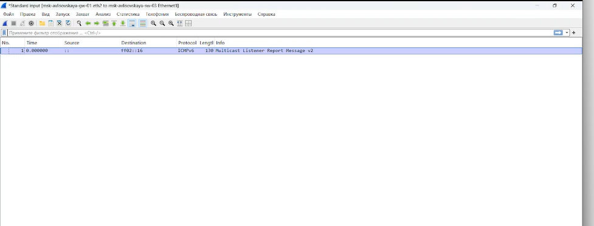{#fig:030 width=70% height=70%}

# Выводы

В ходе выполнения лабораторной работы были приобретены практические навыки настройки службы DHCP на сетевом оборудовании под управлением VyOS. Был успешно настроен DHCP-сервер для IPv4, а также реализованы две схемы настройки IPv6: Stateless (SLAAC + DHCPv6 Info) и Stateful (полное управление адресами через DHCPv6). Правильность настроек подтверждена успешным получением адресов клиентами и проверкой сетевой связности.