---
## Front matter
lang: ru-RU
title: Лабораторная работа №8
subtitle: "Настройка протоколов маршрутизации (RIP, OSPF) и туннелирования IPv6"
author:
  - Лисовская А.В.
institute:
  - Российский университет дружбы народов, Москва, Россия
date: 20 декабря 2025

## i18n babel
babel-lang: russian
babel-otherlangs: english

## Formatting pdf
toc: false
toc-title: Содержание
slide_level: 2
aspectratio: 169
section-titles: true
theme: metropolis
header-includes:
 - \metroset{progressbar=frametitle,sectionpage=progressbar,numbering=fraction}
 - '\\makeatletter'
 - '\\beamer@ignorenonframefalse'
 - '\\makeatother'

## Fonts
mainfont: PT Serif
romanfont: PT Serif
sansfont: PT Sans
monofont: PT Mono
mainfontoptions: Ligatures=TeX
romanfontoptions: Ligatures=TeX
sansfontoptions: Ligatures=TeX,Scale=MatchLowercase
monofontoptions: Scale=MatchLowercase,Scale=0.9
---

## Докладчик

:::::::::::::: {.columns align=center}
::: {.column width="70%"}

  * Лисовская Арина Валерьевна
  * Студентка группы НПИбд-01-23
  * Российский университет дружбы народов
  * [1132231434@rudn.ru](mailto:1132231434@rudn.ru)

:::
::: {.column width="30%"}

:::
::::::::::::::

# Введение

## Цель работы

* Изучение принципов работы и приобретение практических навыков по настройке протоколов динамической маршрутизации (RIP и OSPF).
* Настройка стеков IPv4 и IPv6 (Dual Stack).
* Реализация механизмов туннелирования IPv6 поверх IPv4 (6in4).
* Диагностика сетевых проблем и анализ трафика.

# Базовая настройка сети (1–4)

## Схема сети и топология

Основа лабораторного стенда — топология, включающая маршрутизаторы и клиентские узлы.

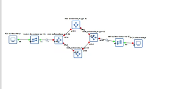{width=60%}

## Настройка интерфейсов и ПК

Базовая настройка IP-адресов на маршрутизаторе и виртуальных ПК (VPCS/PCS) для проверки начальной связности.

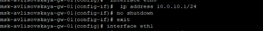{width=30%}
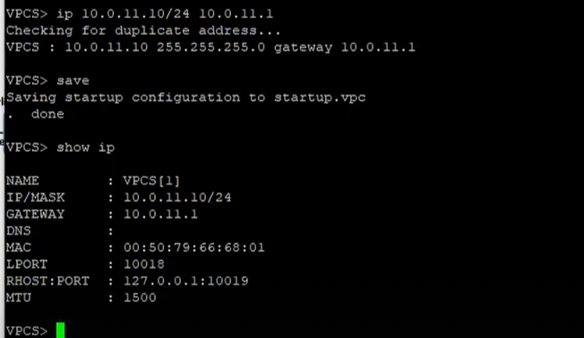{width=30%}
{width=30%}

# Настройка маршрутизаторов FRR (5–10)

## Конфигурация интерфейсов FRR

Назначение адресов на интерфейсы eth0-eth2 и активация интерфейсов командами `no shutdown`.

{width=45%}
{width=45%}

## Проверка и сохранение

Вывод текущей конфигурации (`show running-config`) и сохранение изменений в память (`write memory`).

{width=60%}

# Настройка IPv6 (11–18)

## IPv6 на клиентских узлах

Настройка глобальных адресов IPv6 на виртуальных ПК (2001:10::a и 2001:11::a).

{width=45%}
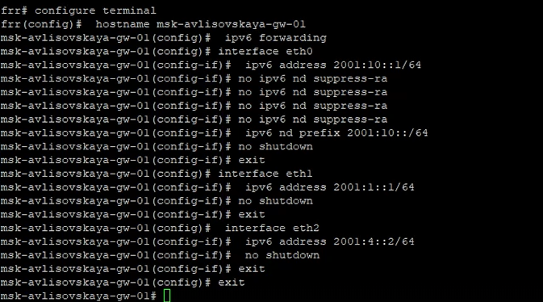{width=45%}

## IPv6 на маршрутизаторах

Включение IPv6-форвардинга и настройка адресации на интерфейсах маршрутизаторов.

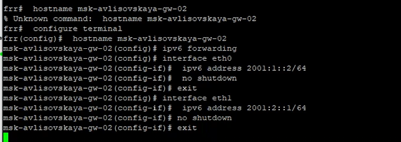{width=45%}
{width=45%}

# Протокол RIP v2 (19–34)

## Конфигурация RIPv2

Настройка процесса RIP, выбор версии и указание анонсируемых сетей на всех узлах.

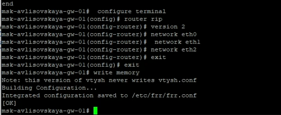{width=45%}
{width=45%}

## Таблицы маршрутизации и отказоустойчивость

Анализ обмена маршрутами и проверка перестроения сети при отключении интерфейса.

{width=30%}
{width=30%}
{width=30%}

## Диагностика RIP

Проверка статуса интерфейсов, маршрутов и финальное тестирование связности.

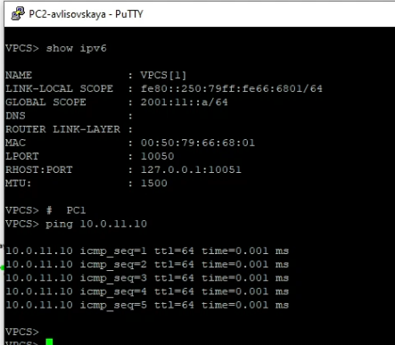{width=45%}
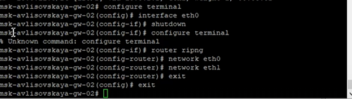{width=45%}

# RIPng и анализ трафика (35–40)

## Работа RIPng (IPv6)

Проверка связности через `ping` и `trace`, просмотр специфичных для IPv6 таблиц RIP.

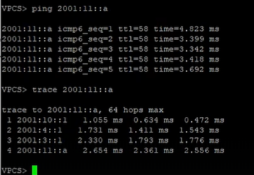{width=45%}
{width=45%}

## Анализ в Wireshark

Изучение структуры пакетов RIPv2, RIPng и ICMP-трафика.

{width=60%}

# Протокол OSPF для IPv4 (41–51)

## Настройка областей OSPF

Конфигурация OSPF в зоне 0 (Area 0) и установление соседства между маршрутизаторами.

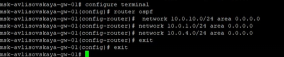{width=45%}
{width=45%}

## Конвергенция и параметры

Анализ Hello-сообщений OSPF, проверка таблицы маршрутизации и таймеров.

{width=45%}
{width=45%}

# Протокол OSPFv3 для IPv6 (52–60)

## Настройка OSPFv3

Использование `router ospf6` и привязка интерфейсов к областям.

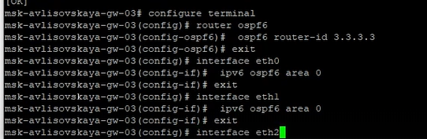{width=45%}
{width=45%}

## Диагностика OSPFv3

Тестирование восстановления связности после имитации сбоя линка и анализ трафика.

{width=45%}
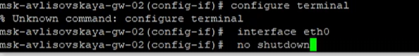{width=45%}

# Туннелирование 6in4 (61–79)

## Схема и подготовка

Реализация туннеля `tun0` для передачи IPv6 трафика через IPv4 инфраструктуру.

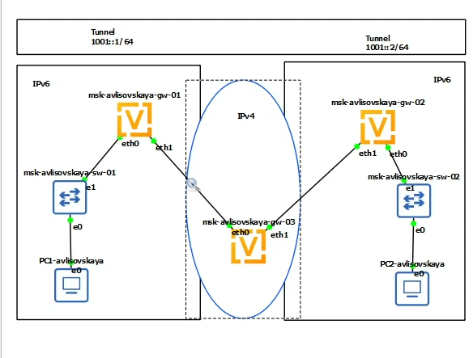{width=60%}

## Конфигурация VyOS и SIT

Использование инкапсуляции SIT, настройка адресации и RIP на VyOS.

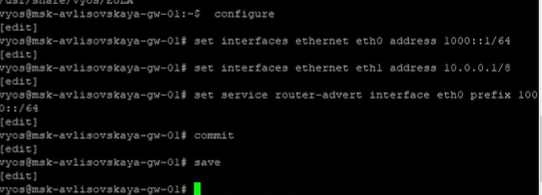{width=45%}
{width=45%}

## Инкапсуляция и трафик

Анализ заголовков пакетов 6in4 в Wireshark и настройка удаленного конца туннеля.

{width=60%}

## Тестирование и отладка

Исправление проблем маршрутизации и подтверждение работоспособности туннеля.

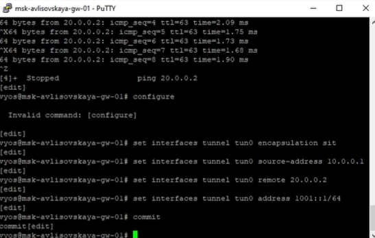{width=30%}
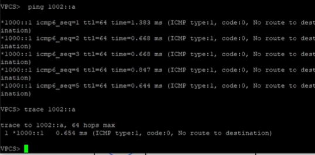{width=30%}
{width=30%}

# Комплексная настройка (80–90)

## Интеграция протоколов на VyOS

Детальная конфигурация маршрутизаторов для совместной работы OSPF и IPv6.

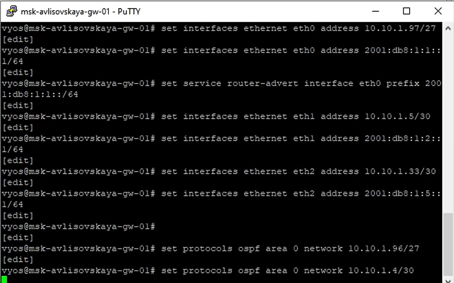{width=45%}
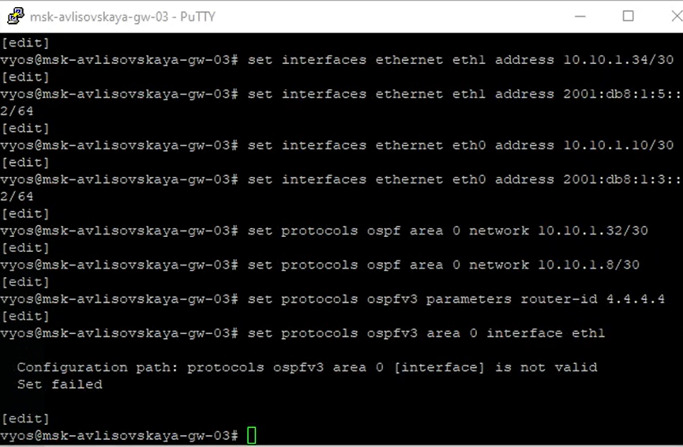{width=45%}

## Диагностика ошибок

Анализ проблем с OSPFv3 и исправление ошибок отсутствия маршрутов.

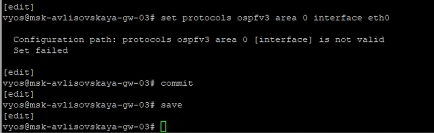{width=45%}
{width=45%}

## Итоговая диагностика

Отключение интерфейсов для проверки устойчивости и финальный анализ таблиц.

{width=60%}

# Заключение

## Результаты работы

* Изучены принципы работы дистанционно-векторных (RIP) и состояний каналов (OSPF) протоколов.
* Успешно настроена сеть Dual Stack (IPv4 + IPv6).
* Реализовано туннелирование 6in4, обеспечивающее связность IPv6-сегментов.
* Освоены методы диагностики в сетевых ОС VyOS и FRR.