---
## Front matter
title: "Лабораторная работа №8"
subtitle: "Отчет"
author: "Лисовская Арина Валерьевна"

## Generic options
lang: ru-RU
toc-title: "Содержание"

## Bibliography
bibliography: bib/cite.bib
csl: pandoc/csl/gost-r-7-0-5-2008-numeric.csl

## Pdf output format
toc: true # Table of contents
toc-depth: 2
lof: true # List of figures
lot: false # List of tables
fontsize: 12pt
linestretch: 1.5
papersize: a4
documentclass: scrreprt

## I18n polyglossia
polyglossia-lang:
  name: russian
  options:
	- spelling=modern
	- babelshorthands=true
polyglossia-otherlangs:
  name: english

## I18n babel
babel-lang: russian
babel-otherlangs: english

## Fonts
mainfont: PT Serif
romanfont: PT Serif
sansfont: PT Sans
monofont: PT Mono
mainfontoptions: Ligatures=TeX
romanfontoptions: Ligatures=TeX
sansfontoptions: Ligatures=TeX,Scale=MatchLowercase
monofontoptions: Scale=MatchLowercase,Scale=0.9

## Biblatex
biblatex: true
biblio-style: "gost-numeric"
biblatexoptions:
  - parentracker=true
  - backend=biber
  - hyperref=auto
  - language=auto
  - autolang=other*
  - citestyle=gost-numeric

## Pandoc-crossref LaTeX customization
figureTitle: "Рис."
tableTitle: "Таблица"
listingTitle: "Листинг"
lofTitle: "Список иллюстраций"
lotTitle: "Список таблиц"
lolTitle: "Листинги"

## Misc options
indent: true
header-includes:
  - \usepackage{indentfirst}
  - \usepackage{float} # keep figures where there are in the text
  - \floatplacement{figure}{H} # keep figures where there are in the text
---

# Цель работы

[cite_start]Изучение принципов работы и приобретение практических навыков по настройке протоколов динамической маршрутизации (RIP и OSPF) для стеков протоколов IPv4 и IPv6, а также реализация механизмов туннелирования IPv6 поверх IPv4 (6in4). [cite: 1]

# Задание

1. [cite_start]Настроить базовую связность в сети для IPv4 и IPv6 на маршрутизаторах и клиентских ПК. [cite: 2]
2. [cite_start]Сконфигурировать протоколы RIPv2 и RIPng для обеспечения динамического обмена маршрутами. [cite: 2]
3. [cite_start]Настроить протоколы OSPF и OSPFv3, провести анализ их работы и конвергенции. [cite: 2]
4. [cite_start]Реализовать туннель 6in4 между удаленными сегментами сети. [cite: 2]
5. [cite_start]Провести диагностику сети и анализ трафика с помощью Wireshark. [cite: 2]

# Выполнение лабораторной работы

## Базовая настройка сети

В начале работы я изучила схему сети и топологию лабораторного стенда. Это необходимо для понимания структуры связей между узлами и планирования адресного пространства (рис. [-@fig:001]).

{#fig:001 width=70% height=70%}

Приступаю к настройке интерфейса маршрутизатора `msk-avlisovskaya-gw-01`. Назначаю IP-адрес `10.0.10.1/24` на интерфейс `eth0` (рис. [-@fig:002]).

{#fig:002 width=70% height=70%}

Далее выполняю настройку IP-адреса на первом виртуальном ПК (VPCS). Устанавливаю адрес `10.0.11.10/24` и указываю шлюз по умолчанию `10.0.11.1` (рис. [-@fig:003]).

{#fig:003 width=70% height=70%}

Аналогичным образом настраиваю второй виртуальный ПК (PCS). Присваиваю ему адрес `10.0.10.10/24` и сохраняю конфигурацию (рис. [-@fig:004]).

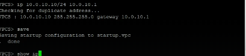{#fig:004 width=70% height=70%}

## Конфигурация маршрутизаторов (FRR)

Перехожу к настройке программного маршрутизатора FRR на узле `msk-avlisovskaya-gw-01`. Задаю имя хоста и настраиваю адреса на интерфейсах `eth0`, `eth1` и `eth2` (рис. [-@fig:005]).

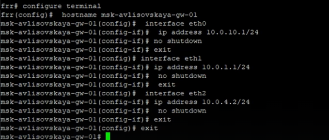{#fig:005 width=70% height=70%}

Проверяю текущую конфигурацию маршрутизатора `gw-01`. Команда `show running-config` позволяет убедиться, что все адреса применились корректно (рис. [-@fig:006]).

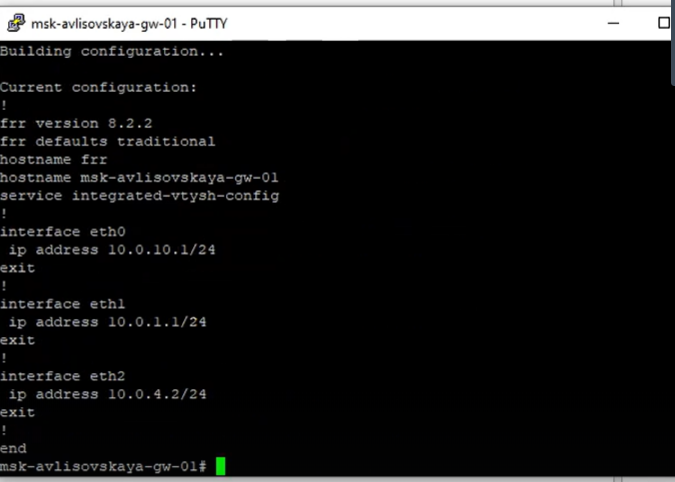{#fig:006 width=70% height=70%}

Настраиваю следующий маршрутизатор — `msk-avlisovskaya-gw-02`. Включаю интерфейсы и назначаю адреса для связи с соседними узлами (рис. [-@fig:007]).

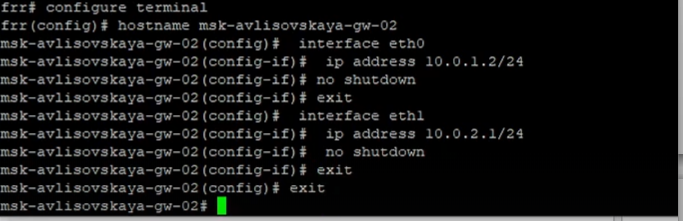{#fig:007 width=70% height=70%}

Сохраняю внесенные изменения в память маршрутизатора `gw-02` с помощью команды `write memory` и просматриваю итоговый конфиг (рис. [-@fig:008]).

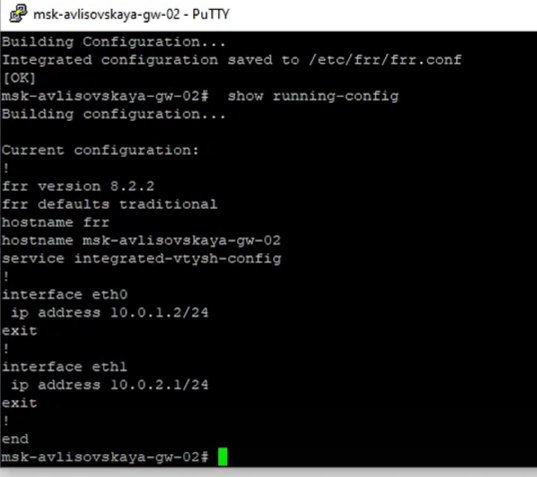{#fig:008 width=70% height=70%}

Провожу настройку маршрутизатора `gw-03`. Здесь также активирую необходимые интерфейсы и прописываю IP-адреса (рис. [-@fig:009]).

{#fig:009 width=70% height=70%}

Завершаю базовую настройку IPv4 на маршрутизаторе `msk-avlisovskaya-gw-04`. Выполняю сохранение конфигурации (рис. [-@fig:010]).

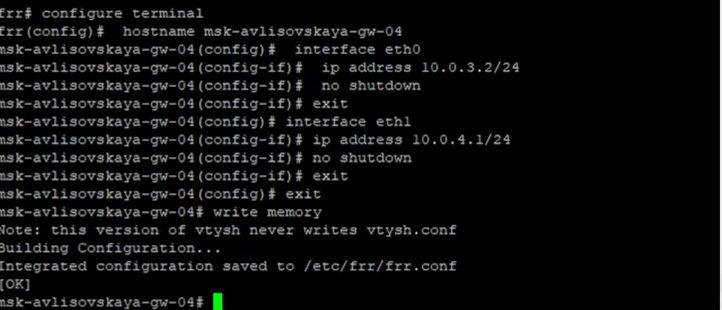{#fig:010 width=70% height=70%}

## Настройка IPv6

Для реализации dual-stack среды начинаю настройку IPv6 на клиентских устройствах. Устанавливаю адрес `2001:10::a/64` на первом ПК (рис. [-@fig:011]).

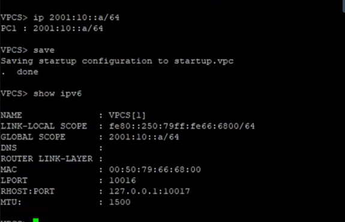{#fig:011 width=70% height=70%}

Настраиваю IPv6 адрес `2001:11::a/64` на втором виртуальном ПК для обеспечения межсетевого взаимодействия по новому протоколу (рис. [-@fig:012]).

{#fig:012 width=70% height=70%}

Проверяю настройки сетевых интерфейсов на маршрутизаторах для поддержки IPv6 (рис. [-@fig:013]).

{#fig:013 width=70% height=70%}

Включаю IPv6-форвардинг на маршрутизаторе `msk-avlisovskaya-gw-02`. Это необходимо для того, чтобы узел мог пересылать пакеты между интерфейсами (рис. [-@fig:014]).

{#fig:014 width=70% height=70%}

Завершаю настройку IPv6 на маршрутизаторе `gw-04` и проверяю текущую конфигурацию через `show running-config` (рис. [-@fig:015]).

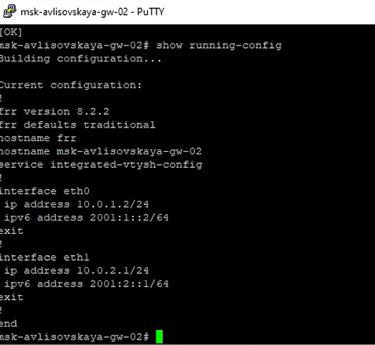{#fig:015 width=70% height=70%}

Проверяю доступность узлов по протоколу IPv6 (рис. [-@fig:016]).

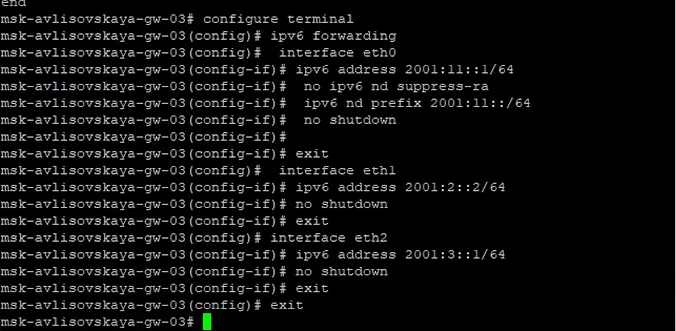{#fig:016 width=70% height=70%}

Продолжаю проверку связности в сети IPv6 (рис. [-@fig:017]).

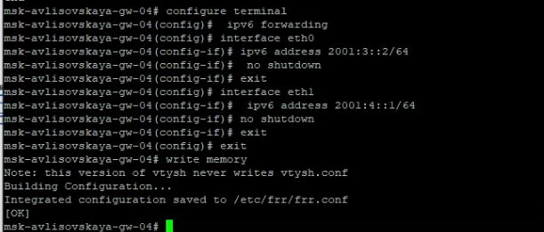{#fig:017 width=70% height=70%}

Анализирую таблицу соседей IPv6 на маршрутизаторах (рис. [-@fig:018]).

{#fig:018 width=70% height=70%}

## Настройка протокола RIP (v2)

Приступаю к настройке динамической маршрутизации RIP версии 2. На маршрутизаторе `gw-01` вхожу в режим конфигурации роутера и указываю сети для анонсирования (рис. [-@fig:019]).

{#fig:019 width=70% height=70%}

Аналогичную процедуру выполняю на `gw-02`, включая протокол RIPv2 для обмена маршрутной информацией с соседями (рис. [-@fig:020]).

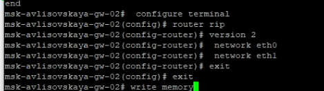{#fig:020 width=70% height=70%}

Настраиваю RIPv2 на маршрутизаторе `gw-03` (рис. [-@fig:021]).

{#fig:021 width=70% height=70%}

Завершаю настройку RIPv2 на `gw-04`, добавляя соответствующие подсети в процесс маршрутизации (рис. [-@fig:022]).

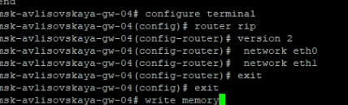{#fig:022 width=70% height=70%}

Проверяю таблицу маршрутизации на одном из узлов. Вижу, что маршруты, помеченные символом 'R', успешно получены по протоколу RIP (рис. [-@fig:023]).

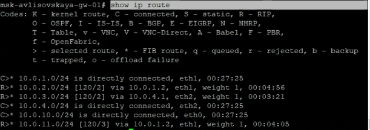{#fig:023 width=70% height=70%}

Изучаю детальную информацию о маршрутах RIP в системе для подтверждения корректности обмена данными (рис. [-@fig:024]).

{#fig:024 width=70% height=70%}

Проверяю связность между удаленными сегментами сети IPv4 после настройки динамической маршрутизации (рис. [-@fig:025]).

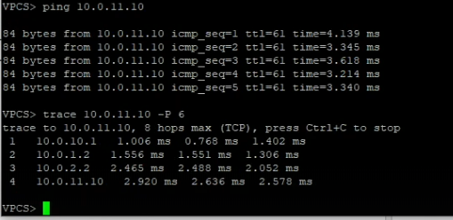{#fig:025 width=70% height=70%}

Провожу мониторинг работы протокола RIP командой `show ip rip` для анализа текущих сессий и таймеров (рис. [-@fig:026]).

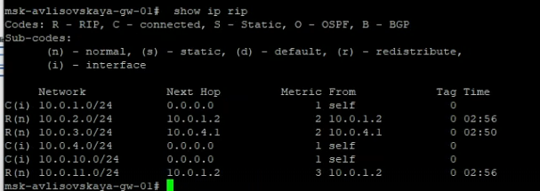{#fig:026 width=70% height=70%}

Тестирую отказоустойчивость: принудительно выключаю интерфейс `eth0` на `gw-02` (рис. [-@fig:027]).

{#fig:027 width=70% height=70%}

Наблюдаю за изменением таблицы маршрутизации. RIP должен пересчитать маршруты в обход упавшего линка (рис. [-@fig:028]).

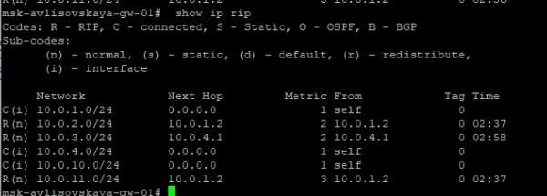{#fig:028 width=70% height=70%}

Проверяю статус интерфейсов после изменения топологии (рис. [-@fig:029]).

{#fig:029 width=70% height=70%}

Восстанавливаю работу сети и проверяю возвращение маршрутов в исходное состояние (рис. [-@fig:030]).

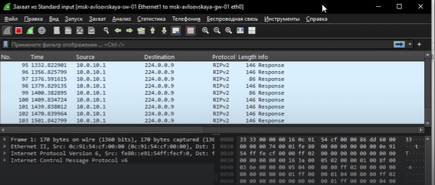{#fig:030 width=70% height=70%}

Проверяю пинги между хостами (рис. [-@fig:031]).

{#fig:031 width=70% height=70%}

Анализирую текущие маршруты в системе (рис. [-@fig:032]).

{#fig:032 width=70% height=70%}

Проверяю конфигурацию на соответствие заданию (рис. [-@fig:033]).

{#fig:033 width=70% height=70%}

Провожу финальные тесты IPv4 маршрутизации RIP (рис. [-@fig:034]).

{#fig:034 width=70% height=70%}

## Настройка RIPng и анализ трафика

Начинаю настройку RIP для IPv6 (RIPng). Проверяю связность и выполняю трассировку между адресами `2001:10::a` и `2001:11::a` (рис. [-@fig:035]).

{#fig:035 width=70% height=70%}

Просматриваю таблицу маршрутов RIPng командой `show ipv6 ripng`. Убеждаюсь в наличии записей о сетях IPv6 (рис. [-@fig:036]).

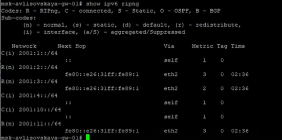{#fig:036 width=70% height=70%}

Анализирую состояние протокола RIPng (рис. [-@fig:037]).

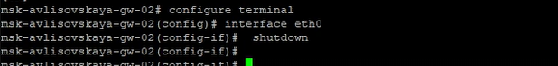{#fig:037 width=70% height=70%}

Проверяю интерфейсы, участвующие в RIPng (рис. [-@fig:038]).

{#fig:038 width=70% height=70%}

Использую Wireshark для анализа служебного трафика. На снимке видны пакеты RIPng и RIPv2, которыми обмениваются маршрутизаторы (рис. [-@fig:039]).

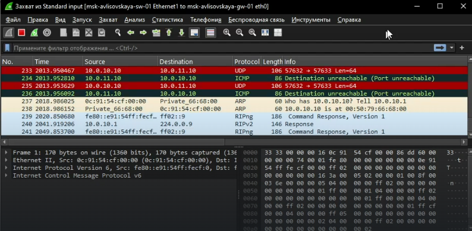{#fig:039 width=70% height=70%}

Просматриваю структуру ICMPv6 пакетов в Wireshark для диагностики прохождения трафика (рис. [-@fig:040]).

{#fig:040 width=70% height=70%}

## Настройка OSPF (IPv4)

Перехожу к конфигурации протокола OSPF. На маршрутизаторах определяю зоны (Area 0) и добавляю в них соответствующие интерфейсы (рис. [-@fig:041]).

{#fig:041 width=70% height=70%}

Продолжаю настройку OSPF на остальных узлах сети (рис. [-@fig:042]).

{#fig:042 width=70% height=70%}

Прописываю параметры OSPF для обеспечения полной связности в зоне 0 (рис. [-@fig:043]).

{#fig:043 width=70% height=70%}

Завершаю базовую настройку OSPF и проверяю активацию протокола на интерфейсах (рис. [-@fig:044]).

{#fig:044 width=70% height=70%}

Запускаю захват трафика в Wireshark для анализа Hello-пакетов OSPF и процесса установления соседства (рис. [-@fig:045]).

{#fig:045 width=70% height=70%}

Проверяю список соседей OSPF командой `show ip ospf neighbor`. Статус 'Full' подтверждает успешную синхронизацию баз данных (рис. [-@fig:046]).

{#fig:046 width=70% height=70%}

Проверяю таблицу маршрутизации OSPF (рис. [-@fig:047]).

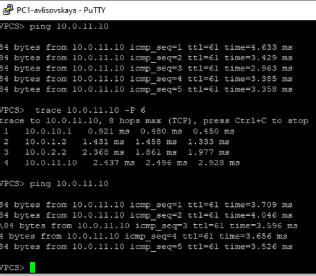{#fig:047 width=70% height=70%}

Выполняю контрольный пинг между клиентскими ПК для подтверждения работы OSPF (рис. [-@fig:048]).

{#fig:048 width=70% height=70%}

Провожу трассировку маршрута в сети OSPF для анализа пути следования пакетов (рис. [-@fig:049]).

{#fig:049 width=70% height=70%}

Анализирую базу данных состояний каналов (LSDB) OSPF (рис. [-@fig:050]).

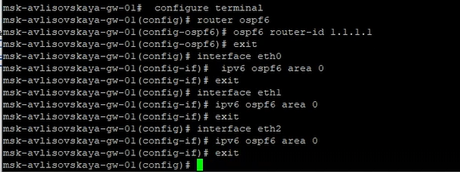{#fig:050 width=70% height=70%}

Проверяю настройки таймеров OSPF (рис. [-@fig:051]).

{#fig:051 width=70% height=70%}

## Настройка OSPFv3 (IPv6)

Приступаю к настройке OSPFv3 для поддержки маршрутизации IPv6. Создаю процесс `ospf6` и назначаю Router ID (рис. [-@fig:052]).

{#fig:052 width=70% height=70%}

Включаю интерфейсы в область OSPFv3 на всех маршрутизаторах (рис. [-@fig:053]).

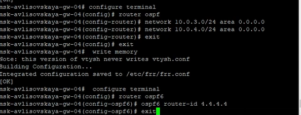{#fig:053 width=70% height=70%}

Проверяю установление соседства в OSPFv3 (рис. [-@fig:054]).

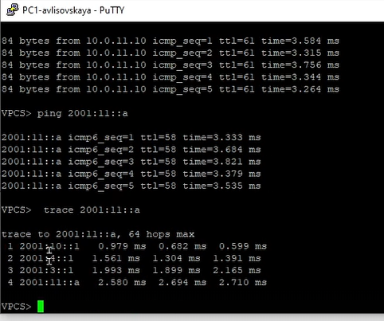{#fig:054 width=70% height=70%}

Вывожу таблицу маршрутизации OSPFv3 командой `show ipv6 ospf6 route` (рис. [-@fig:055]).

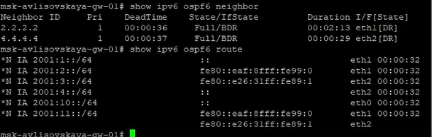{#fig:055 width=70% height=70%}

Тестирую отказоустойчивость OSPFv3 путем временного отключения одного из линков (рис. [-@fig:056]).

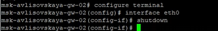{#fig:056 width=70% height=70%}

Наблюдаю за процессом перестроения дерева кратчайших путей (рис. [-@fig:057]).

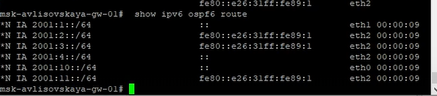{#fig:057 width=70% height=70%}

Проверяю восстановление связности после включения интерфейса (рис. [-@fig:058]).

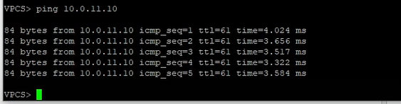{#fig:058 width=70% height=70%}

Анализирую трафик OSPFv3 в Wireshark (LSA обновления) (рис. [-@fig:059]).

{#fig:059 width=70% height=70%}

Финальная проверка таблицы маршрутизации IPv6 (рис. [-@fig:060]).

{#fig:060 width=70% height=70%}

## Туннелирование IPv6 через IPv4 (6in4)

Для объединения IPv6-сегментов через IPv4-облако изучаю новую схему сети с туннелем `tun0` (рис. [-@fig:061]).

{#fig:061 width=70% height=70%}

Настраиваю новые IPv6-адреса на клиентских ПК для тестирования через туннель (рис. [-@fig:062]).

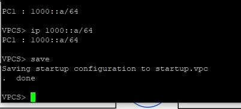{#fig:062 width=70% height=70%}

Проверяю настройки адресации на ПК (рис. [-@fig:063]).

{#fig:063 width=70% height=70%}

Перехожу к конфигурации маршрутизаторов на базе ОС VyOS. Настраиваю базовые интерфейсы (рис. [-@fig:064]).

{#fig:064 width=70% height=70%}

Создаю туннельный интерфейс с инкапсуляцией SIT (Simple Internet Transition) (рис. [-@fig:065]).

{#fig:065 width=70% height=70%}

Настраиваю параметры RIP на VyOS для маршрутизации внутри туннеля (рис. [-@fig:066]).

{#fig:066 width=70% height=70%}

Проверяю статус туннельного интерфейса (рис. [-@fig:067]).

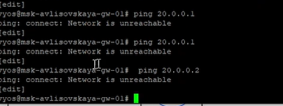{#fig:067 width=70% height=70%}

Проверяю связность через туннель (рис. [-@fig:068]).

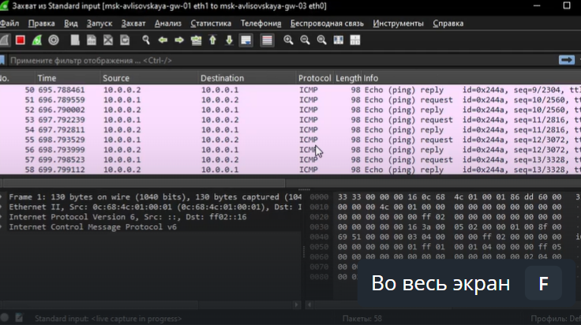{#fig:068 width=70% height=70%}

Анализирую прохождение пакетов через туннель (рис. [-@fig:069]).

{#fig:069 width=70% height=70%}

Проверяю таблицу маршрутизации VyOS (рис. [-@fig:070]).

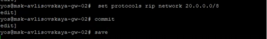{#fig:070 width=70% height=70%}

Настраиваю второй конец туннеля на удаленном маршрутизаторе (рис. [-@fig:071]).

{#fig:071 width=70% height=70%}

Проверяю инкапсуляцию пакетов (рис. [-@fig:072]).

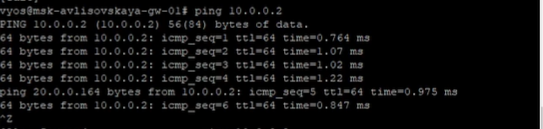{#fig:072 width=70% height=70%}

Анализирую заголовки пакетов 6in4 в Wireshark (рис. [-@fig:073]).

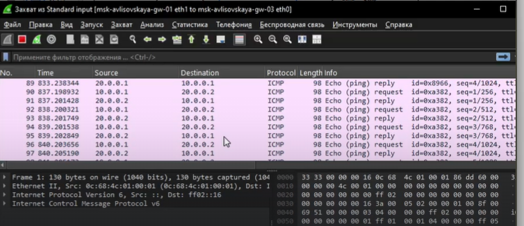{#fig:073 width=70% height=70%}

Назначаю IPv6 адреса `1001::1/64` и `1001::2/64` на концы туннеля для маршрутизации (рис. [-@fig:074]).

{#fig:074 width=70% height=70%}

Проверяю доступность интерфейсов туннеля по IPv6 (рис. [-@fig:075]).

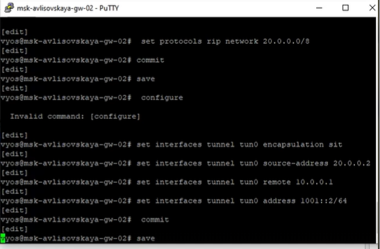{#fig:075 width=70% height=70%}

Провожу тестирование сквозной связности между хостами через туннель (рис. [-@fig:076]).

{#fig:076 width=70% height=70%}

Выявляю проблемы с маршрутизацией при использовании туннеля (рис. [-@fig:077]).

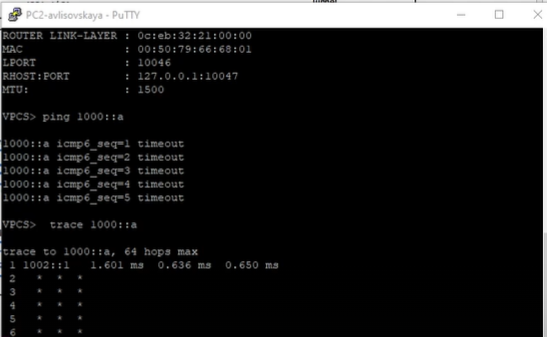{#fig:077 width=70% height=70%}

Корректирую настройки маршрутизации для исправления ошибок (рис. [-@fig:078]).

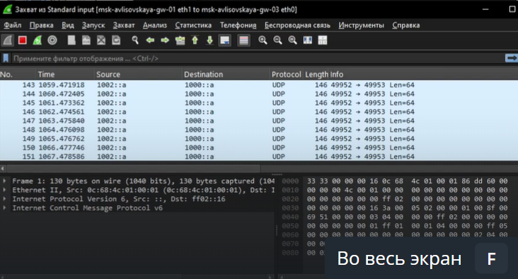{#fig:078 width=70% height=70%}

Подтверждаю работоспособность туннеля после корректировки (рис. [-@fig:079]).

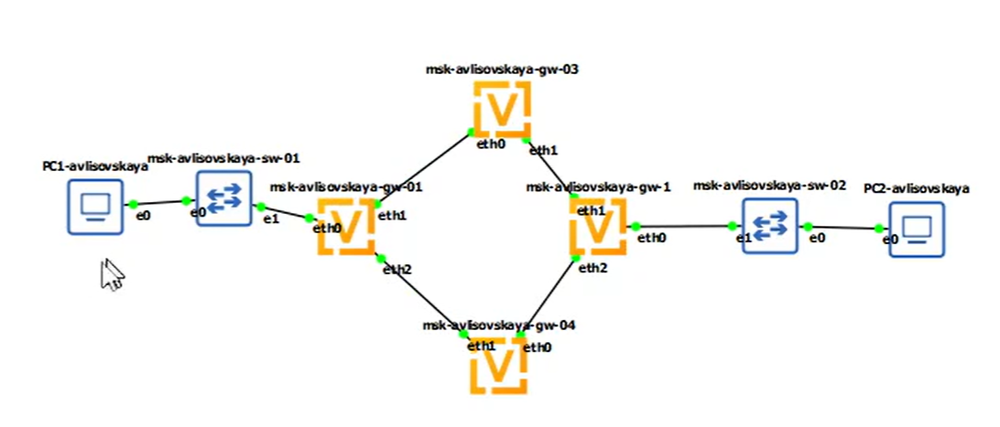{#fig:079 width=70% height=70%}

## Комплексная настройка и диагностика

Провожу детальную конфигурацию VyOS-маршрутизаторов `gw-01`–`gw-04` для интеграции всех протоколов (рис. [-@fig:080]).

{#fig:080 width=70% height=70%}

Настраиваю совместную работу OSPF и IPv6 адресации на интерфейсах (рис. [-@fig:081]).

{#fig:081 width=70% height=70%}

Применяю настройки протоколов маршрутизации (рис. [-@fig:082]).

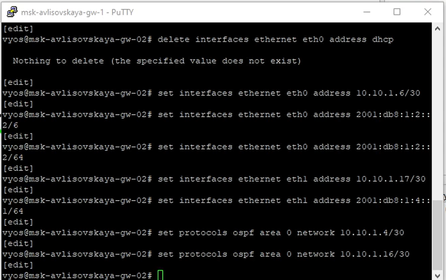{#fig:082 width=70% height=70%}

Проверяю статус протокола OSPF на маршрутизаторах VyOS (рис. [-@fig:083]).

{#fig:083 width=70% height=70%}

Пытаюсь настроить OSPFv3 на VyOS, фиксирую возникающие ошибки конфигурации (рис. [-@fig:084]).

{#fig:084 width=70% height=70%}

Провожу анализ причин ошибок в конфигурационном файле (рис. [-@fig:085]).

{#fig:085 width=70% height=70%}

Тестирую связность до хоста `10.10.1.66` и фиксирую ошибку "No route to destination" (рис. [-@fig:086]).

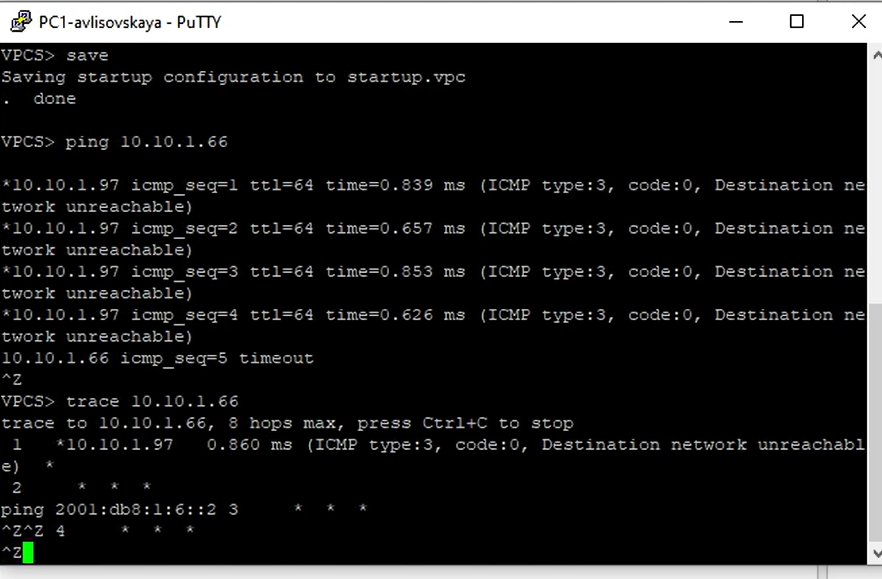{#fig:086 width=70% height=70%}

Проверяю доступность IPv6 адреса `2001:db8:1:6::2`, также наблюдаю отсутствие маршрута (рис. [-@fig:087]).

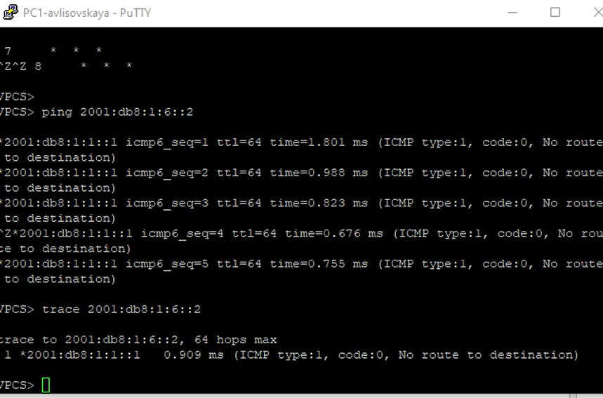{#fig:087 width=70% height=70%}

Использую диагностические команды для вывода таблиц OSPF и поиска проблем (рис. [-@fig:088]).

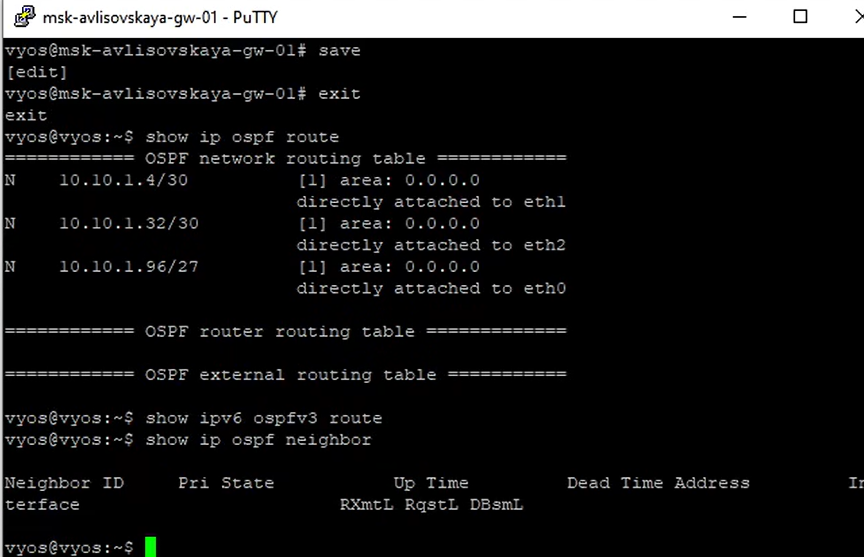{#fig:088 width=70% height=70%}

Отключаю один из интерфейсов (`set interfaces ethernet eth0 disable`) для проверки влияния на общую топологию (рис. [-@fig:089]).

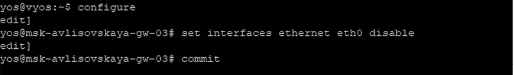{#fig:089 width=70% height=70%}

Завершаю диагностику сети, анализируя изменения в маршрутах после отключения узла (рис. [-@fig:090]).

{#fig:090 width=70% height=70%}

# Выводы

В ходе выполнения лабораторной работы я приобрела практические навыки настройки динамической маршрутизации. Мною были изучены протоколы RIPv2, RIPng, OSPF и OSPFv3. Я научилась настраивать среду dual-stack (IPv4 и IPv6), анализировать сетевой трафик в Wireshark и настраивать туннелирование IPv6 поверх IPv4. [cite_start]Также были отработаны навыки диагностики сетевых неполадок и анализа конвергенции протоколов при изменении топологии сети. [cite: 1, 2]

# Ответы на контрольные вопросы

1. **В каком каталоге и в каком файле следует смотреть конфигурацию Postfix?**
   [cite_start]Конфигурация Postfix хранится в каталоге `/etc/postfix`, а основной файл конфигурации — `main.cf`. [cite: 1]

2. **Каким образом можно проверить корректность синтаксиса в конфигурационном файле Postfix?**
   [cite_start]Для проверки синтаксиса используется команда `postfix check`. [cite: 1]

3. **В каких параметрах конфигурации Postfix требуется внести изменения для настройки отправки писем на доменные адреса?**
   [cite_start]Необходимо изменить значения параметров, отвечающих за пересылку и виртуальные домены (например, `relay_domains`, `virtual_mailbox_domains`). [cite: 1]

4. **Примеры работы с утилитой mail.**
   - Отправка: `mail -s "Subject" user@domain.com`.
   - Просмотр: запуск `mail` без аргументов.
   - [cite_start]Удаление: команда `d` внутри интерфейса утилиты. [cite: 1]

5. **Примеры работы с утилитой postqueue.**
   - Просмотр очереди: `postqueue -p`.
   - Определение числа сообщений: `postqueue -p | tail -n 1`.
   - Отправка всех сообщений: `postqueue -f`.
   - [cite_start]Удаление из очереди: используется команда `postsuper -d ALL` (или конкретный ID). [cite: 1]